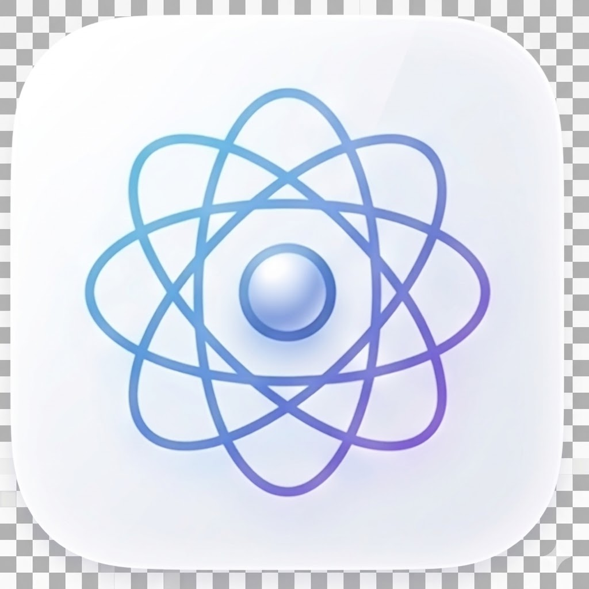
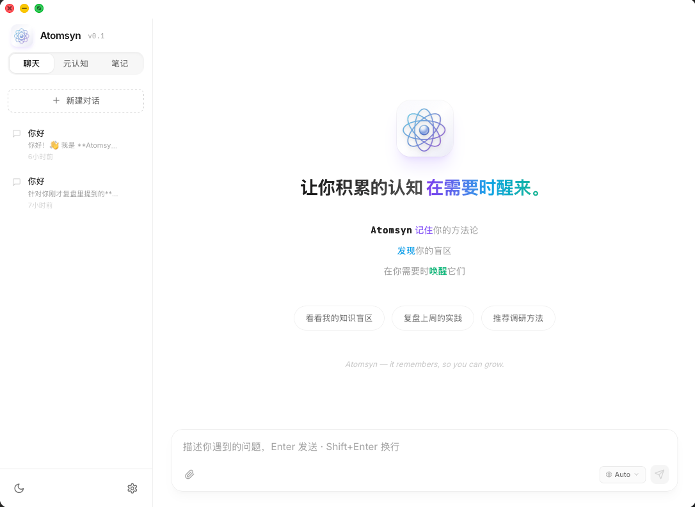
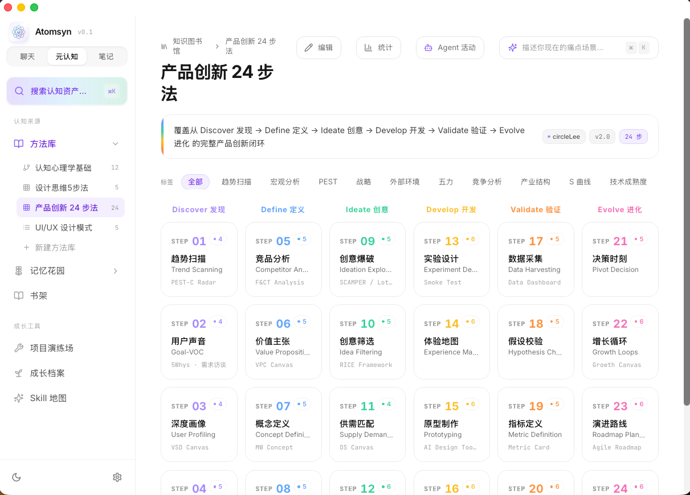
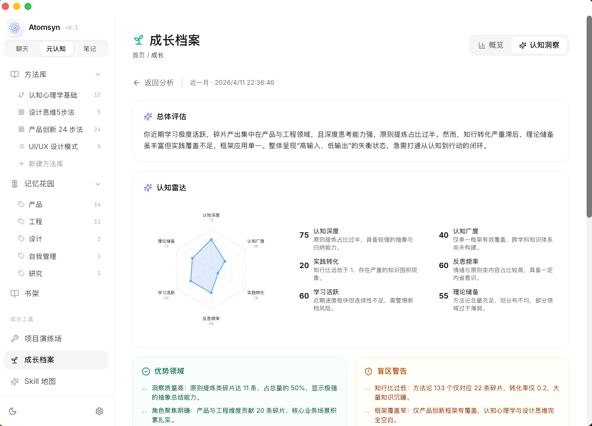
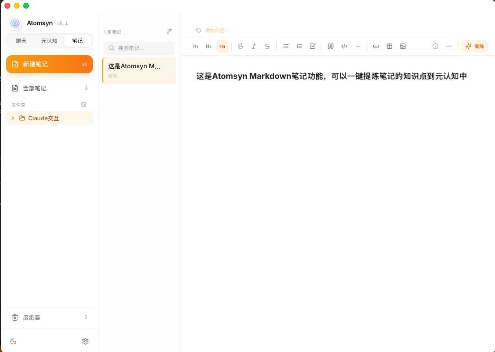

<p align="center">
  
</p>

<h1 align="center">Atomsyn</h1>

<p align="center">
  <strong>Your knowledge, your rules, always accessible.</strong><br/>
  A local-first personal knowledge vault that turns scattered insights into a structured, AI-retrievable cognitive map.
</p>

<p align="center">
  <a href="https://github.com/lihuan6015-droid/AtomSyn/actions/workflows/ci.yml"></a>
  <a href="LICENSE"></a>
  
  
</p>

<p align="center">
  <a href="README_CN.md">中文</a> | <strong>English</strong>
</p>

---

## What is Atomsyn?

Methodologies you've studied, insights from AI conversations, lessons from real-world projects — they don't disappear, they just fall asleep in scattered notes and chat histories.

**Atomsyn** wakes them up. It's a cross-platform desktop app that gives you:

- **A structured vault** for your knowledge assets (methodologies, experience fragments, skill inventories)
- **An AI-aware interface** so Claude, Cursor, and other AI coding tools can read and write to your vault during conversations
- **A coaching layer** that reveals blind spots and nudges you to apply what you've learned

Everything stays 100% on your machine. No cloud, no subscription, no lock-in.

## Key Features

- **Atom Garden** — Browse your knowledge by methodology frameworks, roles, or custom organizations with progressive disclosure
- **Agent Integration** — Install skills for Claude Code / Cursor so AI assistants can read from and write to your vault naturally
- **Skill Map** — Visualize all your AI tools and their integration status at a glance
- **Cognitive Radar** — See where your knowledge is deep and where the gaps are
- **Growth Analytics** — Track your learning trajectory and knowledge accumulation over time
- **Rich Editor** — Built-in TipTap-powered markdown editor for notes and atom content
- **Command Palette** — Quick search and navigation with `Cmd+K` / `Ctrl+K`
- **Dark Mode** — Full light/dark theme support

## Screenshots

<p align="center">
  
  
</p>
<p align="center">
  
  
</p>

## Quick Start

### Download

Pre-built binaries are available on the [Releases](https://github.com/lihuan6015-droid/AtomSyn/releases) page:

| Platform | Format |
|---|---|
| macOS (Apple Silicon) | `.dmg` |
| macOS (Intel) | `.dmg` |
| Windows | `.msi` / `.exe` |

On first launch, Atomsyn seeds your local vault with a starter methodology framework (Product Innovation 24-Step) containing 125+ methodology atoms so you can explore immediately.

> **macOS users**: The app is not signed with an Apple Developer certificate yet. macOS may show "Atomsyn is damaged and can't be opened." This is a Gatekeeper restriction, not actual file corruption. To fix it, run in Terminal after installing:
> ```bash
> sudo xattr -cr /Applications/Atomsyn.app
> ```

### Build from Source

**Prerequisites**: Node.js 22+, Rust toolchain ([rustup](https://rustup.rs/))

```bash
# Clone the repository
git clone https://github.com/lihuan6015-droid/AtomSyn.git
cd AtomSyn

# Install dependencies
npm install

# Run in development mode (web)
npm run dev

# Run as desktop app
npm run tauri:dev

# Build for production
npm run tauri:build
```

## Agent Integration (for developers)

Atomsyn ships with a CLI and skills that plug into AI coding tools like Claude Code and Cursor. This enables your AI assistant to read from and write to your knowledge vault during conversations.

> **Note**: Agent integration currently requires building from source. One-click skill installation from the desktop app is on our roadmap.

```bash
# Install skills for Claude Code and/or Cursor
node scripts/atomsyn-cli.mjs install-skill --target claude,cursor

# Add the CLI to your PATH (follow the printed instructions)
# Then verify:
atomsyn-cli where
```

Once installed, you can use natural language in your AI conversations:

| You say... | What happens |
|---|---|
| "Save this to my atomsyn" / "Remember this" | `atomsyn-write` crystallizes the insight into a structured atom |
| "Check my atomsyn" / "Have I seen this before?" | `atomsyn-read` retrieves relevant knowledge from your vault |
| "Review my growth" / "What are my blind spots?" | `atomsyn-mentor` generates a reflection report |

## Data Storage

All data lives as plain JSON files on your machine:

| Platform | Default Location |
|---|---|
| macOS | `~/Library/Application Support/atomsyn/` |
| Windows | `%APPDATA%\atomsyn\` |
| Linux | `~/.local/share/atomsyn/` |

## Tech Stack

| Category | Technology |
|---|---|
| Frontend | React 18 + TypeScript + Vite 6 |
| Desktop | Tauri v2 (Rust) |
| Styling | TailwindCSS 3 |
| Animation | Framer Motion 11 |
| State | Zustand 5 |
| Editor | TipTap |
| Search | Fuse.js |
| Schema | Ajv 8 |

## Development

```bash
npm run dev          # Vite dev server + data API
npm run build        # Type check + production build
npm run lint         # TypeScript strict check
npm run reindex      # Rebuild knowledge index
npm run tauri:dev    # Desktop app dev mode
npm run tauri:build  # Desktop app production build
npm run test:cli     # CLI regression tests
```

## Contributing

We welcome contributions! Please see [CONTRIBUTING.md](CONTRIBUTING.md) for guidelines on:

- Setting up your development environment
- Our branch strategy and PR process
- Commit message conventions
- Code style guidelines

## Roadmap

- Chat module with streaming markdown and inline atom references
- Bookshelf for organizing methodology reading lists
- One-click agent skill installation from the desktop app
- Enhanced cognitive coaching with personalized action plans
- Plugin system for custom knowledge frameworks
- Multi-language UI support

## License

This project is licensed under the Apache License 2.0 — see the [LICENSE](LICENSE) file for details.

## Acknowledgments

- Design inspiration: [Linear](https://linear.app), [Raycast](https://raycast.com), Apple HIG
- Built with [Tauri](https://tauri.app), [React](https://react.dev), [TailwindCSS](https://tailwindcss.com)
