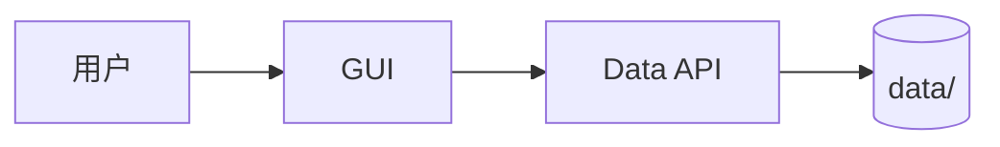
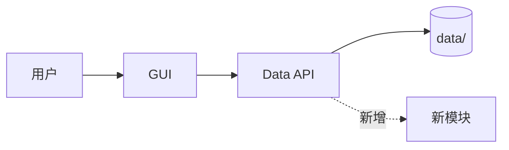
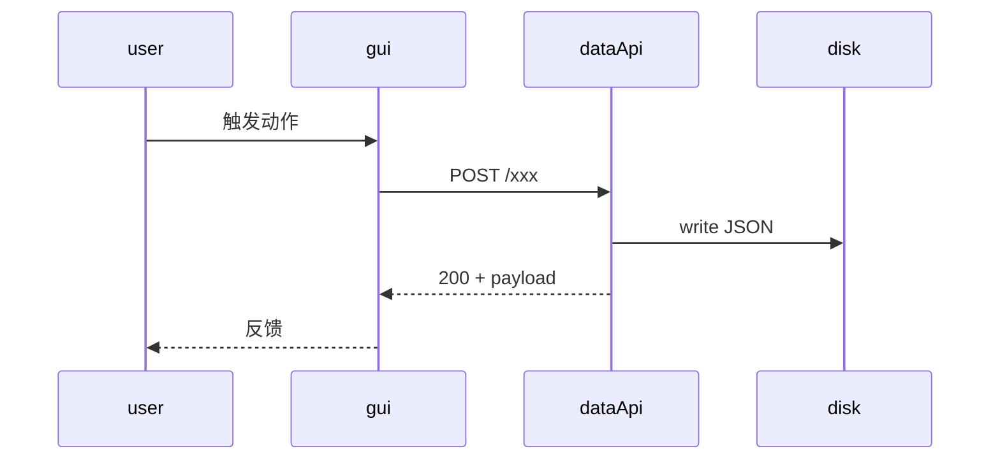

<!--
========================================================================
DESIGN · 设计模板
========================================================================
本文件回答 HOW: 架构、数据流、决策、迁移。
- 在 proposal 已对齐 WHY/WHAT 后才填本文件
- 设计的目标读者是: 6 个月后接手实施的人
- 写完应该可以让人不读代码就理解整个改动的"骨架"
========================================================================
-->

# Design · {change_id}

> **上游**: `proposal.md` (本目录) · `docs/framing/...`
> **状态**: draft / reviewed / locked
> **最后更新**: 2026-MM-DD

---

## 1 · 系统视图 (System View)
<!--
  当前系统的相关部分长什么样? 用 mermaid 或 ASCII 框图。
  范围控制: 只画与本 change 直接相关的模块/数据流, 不要画整个 Atomsyn。
-->




## 2 · 目标设计 (Target Design)
<!--
  本 change 落地后, 同一个范围长什么样? 用同样的画法 + 高亮变化部分。
-->




## 3 · 关键流程 (Key Flows)
<!--
  挑 2-3 个核心流程, 用 sequence diagram 或编号步骤写清楚。
  每个流程要回答: 触发点 → 各方调用顺序 → 失败回退 → 副作用。
-->

### 3.1 流程 A · {名字}



### 3.2 流程 B · {名字}
<!-- 同上 -->


## 4 · 数据模型变更 (Data Model Changes)
<!--
  本 change 是否动 schema?
  - 如否: 写 "无 schema 变更", 跳过本节
  - 如是: 给出 diff 和迁移策略
-->

### 4.1 受影响的 schema

| 文件 | 变更类型 | 摘要 |
|---|---|---|
| `skills/schemas/atom.schema.json` | additive / breaking | 新增字段 / 修改类型 / ... |

### 4.2 字段 diff

```diff
{
  "id": "...",
+ "newField": "string"
- "oldField"
}
```

### 4.3 旧数据兼容
<!-- 已有 atom JSON 怎么办? lazy 迁移 / 一次性脚本 / 双读 -->


## 5 · 接口契约 (Interface Contracts)
<!--
  本 change 触动的 CLI 命令、API 路由、Skill 触发条件、组件 props。
  每个接口要列: 输入、输出、错误、副作用。
-->

### 5.1 atomsyn-cli
<!-- 如不动 CLI, 标记 "无变更" -->

```
atomsyn-cli <new-command> --foo <bar>
```

| 字段 | 类型 | 必填 | 说明 |
|---|---|---|---|
| --foo | string | yes | ... |

退出码:
- `0` 成功
- `2` 找不到目标
- `1` 其他错误

副作用:
- 写入 `data/...`
- 触发 reindex

### 5.2 数据 API (Vite 中间件 + Tauri 路由双通道)
<!-- 必须同时在 vite-plugin-data-api.ts 和 src/lib/tauri-api/routes/*.ts 实现 -->

| 方法 | 路径 | 请求体 | 响应 | 错误 |
|---|---|---|---|---|
| POST | /xxx | `{...}` | `{ok: true, ...}` | 4xx / 5xx |

### 5.3 Skill 契约
<!-- 如本 change 影响 atomsyn-write/read/mentor 的触发条件、Token 预算、不可变承诺 -->


## 6 · 决策矩阵 (Decision Matrix)
<!--
  关键设计抉择放表格里, 一行一个决策。
  没在这里出现的决策, 应该放进 decisions.md 详细记录。
  本表是"概览", decisions.md 是"详细 ADR"。
-->

| # | 决策点 | 选项 | 利 | 弊 | 选哪个 | 为什么 |
|---|---|---|---|---|---|---|
| D1 | 数据存储位置 | 单文件 / 分目录 | ... | ... | 分目录 | 与现有 atoms 结构一致 |
| D2 | ... | ... | ... | ... | ... | ... |


## 7 · 安全与隐私 (Security & Privacy)
<!--
  Atomsyn 是 100% 本地优先工具, 但仍要回答:
  - 敏感字段 (API key, token, 个人识别信息) 怎么处理?
  - 数据是否会出本地? (理论上永远不会, 但任何 LLM 调用都是出本地)
  - LLM prompt 中是否会泄漏用户隐私?
-->

- 数据流向:
- 敏感字段:
- LLM prompt 隐私边界:


## 8 · 性能与规模 (Performance & Scale)
<!--
  - 预期数据量级 (atoms 数 / projects 数 / log 条目)
  - 时延预算 (用户感知 < 200ms / 后台任务 < 5s / ...)
  - Token 预算 (如涉及 LLM, 每次调用 cap 多少 token)
  - 磁盘占用 (如生成索引/缓存)
-->

| 维度 | 当前 | 预期上限 | 是否需要分页/分批 |
|---|---|---|---|
| atom 数 | ~200 | ~5000 | 否 / 是 (说明) |
| ... | ... | ... | ... |


## 9 · 可观测性 (Observability)
<!--
  - 关键事件如何记录? (data/growth/usage-log.jsonl 还是新通道?)
  - 错误处理: 用户可见错误是什么样? 静默失败的边界在哪?
  - 回退路径: 主流程失败后, 用户看到什么?
  - 调试: 开发者怎么看到这条流程的内部状态?
-->

- 事件日志:
- 错误反馈:
- 回退路径:
- 调试入口:


## 10 · 兼容性与迁移 (Compatibility & Migration)
<!--
  - 旧版本用户的现有数据怎么办?
  - 是否需要写迁移脚本?
  - 灰度策略: feature flag? 配置开关? 直接默认开启?
  - 升级路径: 用户从 vX 升到 vX+1 时,这个 change 是无感的吗?
-->

| 场景 | 处理方式 |
|---|---|
| 全新用户 | 默认启用 |
| 老用户已有数据 | lazy migration / 启动时一次性脚本 |
| 出错回退 | ... |


## 11 · 验证策略 (Verification Strategy)
<!--
  本 change 实施完毕后, 怎么证明它是对的?
  - 自动化: 单元测试 / 集成测试覆盖哪些路径?
  - 手动: 必须 dogfood 跑通的端到端场景
  - 不变量: 哪些既有行为不能被本 change 破坏?
-->

- 自动化测试:
- 手动 dogfood 场景:
- 关键不变量:


## 12 · Open Questions
<!--
  设计阶段未决问题列表。每个问题应该有: 谁来回答, 何时回答。
  不要让 open question 进 implement 阶段。
-->

- [ ] ...
- [ ] ...


---

<!--
========================================================================
设计就绪后, 状态从 draft → reviewed → locked。
locked 后才能进入 implement 阶段。
implement 中如发现 design 不准确, 不要直接改代码, 回来更新 design + decisions.md。
========================================================================
-->
