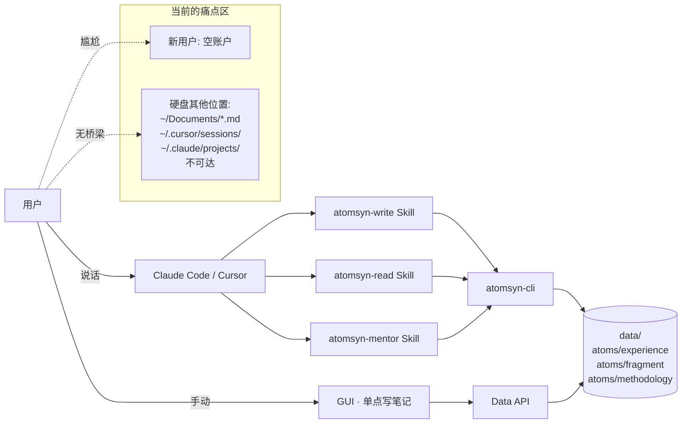
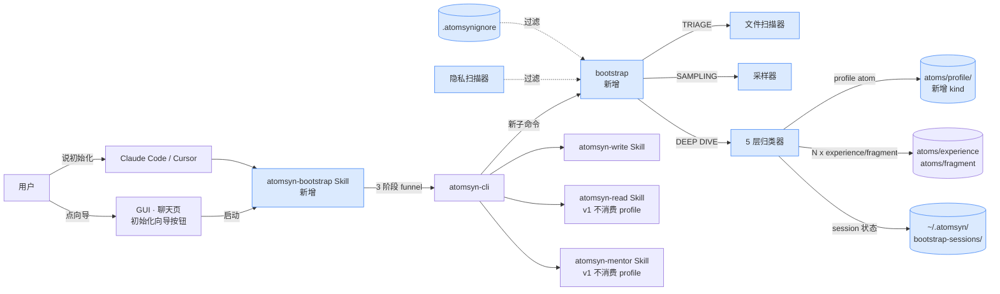
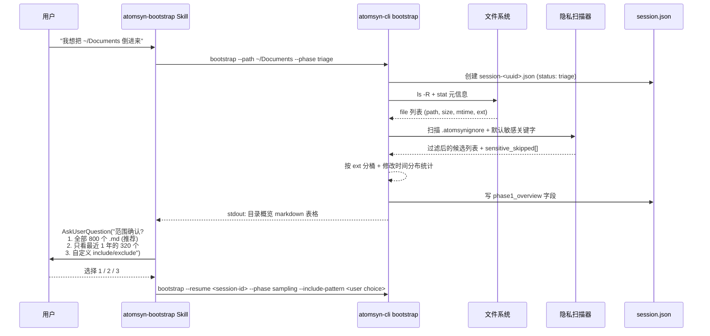
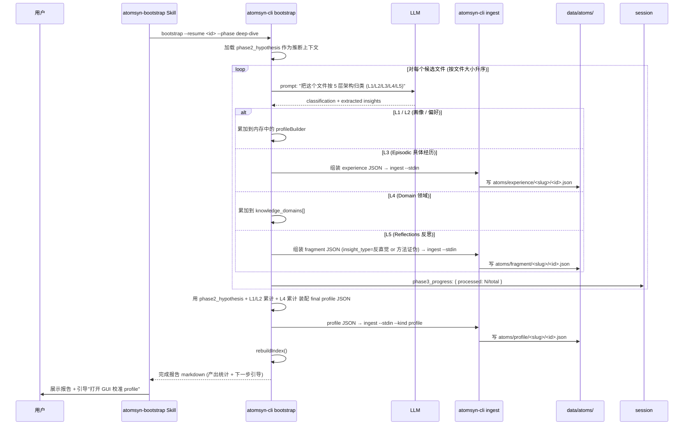
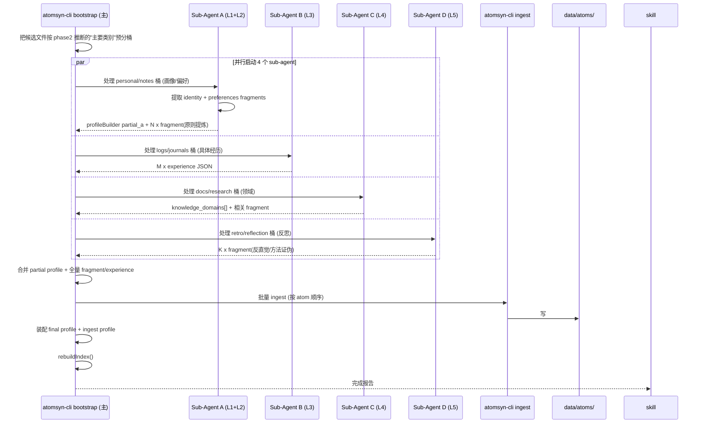

# Design · 2026-04-bootstrap-skill

> **上游**: `proposal.md` (本目录) · `docs/framing/v2.x-north-star.md` · `~/.claude/skills/gstack/plan-tune/SKILL.md`
> **状态**: draft
> **最后更新**: 2026-04-26

---

## 1 · 系统视图 (System View)

当前系统 (V2.1 已交付状态), 与本 change 相关的部分:



关键观察: 现有写入路径都是 1-conversation-1-atom, 没有任何模块负责"批量 import 存量"。

## 2 · 目标设计 (Target Design)



核心变化 (蓝色高亮):

1. 新增 `atomsyn-bootstrap` Skill (Claude Code / Cursor 侧入口)
2. 新增 `atomsyn-cli bootstrap` 子命令 (CLI 实现)
3. 新增 atom kind `profile` + 目录 `atoms/profile/<slug>/`
4. 新增 bootstrap session 持久化目录 `~/.atomsyn/bootstrap-sessions/`
5. 隐私扫描器 + `.atomsynignore` 过滤
6. GUI 聊天页新增"初始化向导"按钮

read / mentor Skill 在 v1 内**接口不变**, 仅在 design.md 标注 v2 集成点。

## 3 · 关键流程 (Key Flows)

### 3.1 流程 A · Phase 1 TRIAGE (扫描概览)

触发点: 用户调用 `atomsyn-cli bootstrap --path <dir> --phase triage` 或在 GUI 向导点"开始扫描"。



关键约定:

- TRIAGE **不读文件内容**, 只读元信息 (`stat()`)
- 总耗时 < 30s, 即便 10000 文件
- 输出 markdown 表格示例:
  ```
  | 类型 | 数量 | 总大小 | 最近修改 |
  |---|---|---|---|
  | .md | 800 | 12 MB | 2026-04-25 |
  | .txt | 45 | 200 KB | 2025-11-12 |
  | sensitive_skipped | 3 | n/a | n/a |
  ```
- 失败回退: 路径不存在 → exit 2; 无读权限 → exit 1 + stderr 提示用户检查 `chmod`

### 3.2 流程 B · Phase 2 SAMPLING (采样推断画像)

触发点: 用户在 Phase 1 后确认范围 → Skill 自动启动 SAMPLING。

```mermaid
sequenceDiagram
  participant user as 用户
  participant skill as atomsyn-bootstrap Skill
  participant cli as atomsyn-cli bootstrap
  participant llm as LLM (用户配置)
  participant session as session.json

  skill->>cli: bootstrap --resume <id> --phase sampling
  cli->>cli: 从 phase1 结果按"代表性"抽样 (每类 3-5 个)
  cli->>cli: 抽样规则: README 必抽; 每个项目根目录核心文件; 最近 30 天内修改的文件; 单文件 size 中位数附近
  cli-->>cli: 采样列表 (15-30 个文件)
  cli->>cli: 读取采样文件全文
  cli->>llm: prompt: "根据这 N 个文件, 推断用户角色 / 主要工具 / 知识领域 / 5 个数值维度的初步估计"
  llm-->>cli: 推断 JSON
  cli->>session: 写 phase2_hypothesis
  cli-->>skill: stdout: 画像假设 markdown
  skill->>user: 展示 + AskUserQuestion("画像确认?<br/>1. 准确, 继续<br/>2. 我补充: <文本框><br/>3. 重新采样")
  user-->>skill: 反馈
  skill->>cli: bootstrap --resume <id> --phase deep-dive [--user-correction <txt>]
```

关键约定:

- SAMPLING 单次 LLM 调用 token 上限: 输入 ≤ 30k, 输出 ≤ 4k (调用方 LLM 的 context budget 由用户 llm.config.json 决定)
- 输出不写入任何 atom, 只写 phase2_hypothesis 到 session 文件
- 失败回退: LLM 调用失败 → 提示用户检查 llm.config.json, 允许用户跳过此 phase 直接进 deep-dive (但准确率会低)

### 3.3 流程 C · Phase 3 DEEP DIVE 串行模式 (默认)

触发点: 用户在 Phase 2 校准后 → Skill 自动启动 DEEP DIVE (默认串行)。



关键约定:

- 串行处理保证可被 Ctrl-C 安全中止 (session 文件随时可 resume)
- 单文件 LLM 调用失败重试 1 次, 仍失败则跳过并记录到 `phase3_skipped[]`, 继续下一个
- 每 ingest 一条 atom 都标记 `imported: true` + `bootstrap_session_id: <id>`, 便于 mentor 后续过滤
- 每条 atom 的 `confidence` 默认 0.5 (而非用户手写的 0.85), 让 cognitive-evolution 的衰减机制兜底

### 3.4 流程 D · Phase 3 DEEP DIVE 并行模式 (`--parallel`)

触发点: 用户调用 `atomsyn-cli bootstrap --path <dir> --parallel`。



关键约定:

- 4 个 sub-agent 是逻辑分桶, 实现层可以是: (a) 4 个并行的 LLM 调用 (token cost 4x); (b) 单 agent 用 4 轮多任务 prompt; 由 design.md §6 D-004 详细决策
- 失败模式: 任一 sub-agent 抛错, 主 cli 收集已完成的 partial 结果, 写入 session, 报告"3/4 完成, A 失败 due to xxx, --resume 继续"
- 必须确保 ingest 顺序: experience/fragment 先于 profile (因为 profile 的 evidence_atom_ids 需引用前者的 id)

## 4 · 数据模型变更 (Data Model Changes)

### 4.1 受影响的 schema

| 文件 | 变更类型 | 摘要 |
|---|---|---|
| `skills/schemas/atom.schema.json` | additive | 新增 `kind: "profile"` 分支, 新增字段 `imported`, `bootstrap_session_id` (可选, 任意 kind 可有) |
| `skills/schemas/profile-atom.schema.json` | new file | 新建 profile atom 子 schema |
| `src/types/index.ts` | additive | 在 discriminated union 加 `ProfileAtom` 类型 |
| `data/atoms/profile/` | new dir | profile atom 存储位置 |

### 4.2 字段 diff

新增的 `ProfileAtom` 完整结构 (与现有 atom union 兼容):

```diff
{
  "id": "atom_profile_<slug>",
+ "kind": "profile",
  "schemaVersion": 1,
  "name": "用户元认知画像 - 2026-04-26",
  "createdAt": "2026-04-26T10:00:00Z",
  "updatedAt": "2026-04-26T10:00:00Z",

+ "verified": false,
+ "verifiedAt": null,
+ "inferred_at": "2026-04-26T10:00:00Z",
+ "source_summary": "扫描了 ~/Documents 下 240 个 markdown, 跨 18 个月 (2024-10 ~ 2026-04)",

+ "identity": {
+   "role": "前端工程师 + 独立产品开发者",
+   "working_style": "小步迭代 + 重视架构",
+   "primary_languages": ["TypeScript", "Rust"],
+   "primary_tools": ["VSCode", "Cursor", "Claude Code", "Tauri", "Vite"]
+ },

+ "preferences": {
+   "scope_appetite": 0.7,
+   "risk_tolerance": 0.4,
+   "detail_preference": 0.8,
+   "autonomy": 0.5,
+   "architecture_care": 0.85
+ },

+ "knowledge_domains": ["前端工程", "Rust/Tauri 桌面应用", "产品设计", "AI Agent 工作流"],
+ "recurring_patterns": [
+   "遇到性能问题先看 profiler 不猜测",
+   "新方案先在 spike 文档落字再编码",
+   "重构总是先加测试再动结构"
+ ],

+ "evidence_atom_ids": ["atom_exp_xxx", "atom_frag_yyy", "atom_exp_zzz"],

+ "previous_versions": [
+   {
+     "version": 1,
+     "supersededAt": "2026-04-26T10:00:00Z",
+     "snapshot": { "preferences": {...}, "identity": {...}, "knowledge_domains": [...] },
+     "trigger": "bootstrap_rerun" | "user_calibration" | "agent_evolution",
+     "evidence_delta": ["atom_exp_aaa"]
+   }
+ ],

  "stats": {
+   "imported": true,
+   "bootstrap_session_id": "boot_<uuid>",
    "viewedCount": 0,
    "locked": false,
    "userDemoted": false
  }
}
```

**单例约定 (D-010)**: `id` 固定为 `atom_profile_main`, 文件路径 `<dataDir>/atoms/profile/main/atom_profile_main.json`。每次 bootstrap 重跑或用户校准时, 现有 profile 的当前快照被推入 `previous_versions[]` 数组顶部, 然后用新数据覆写顶层字段。`previous_versions` 是有序数组 (新→旧), v1 不限长度但实施时建议在 GUI 显示前 10 条。

任意 kind 的 atom (experience / fragment / methodology / skill-inventory / profile) 都可有 (additive):

```diff
  "stats": {
+   "imported": false,                    // bootstrap 写入时 true
+   "bootstrap_session_id": null,         // bootstrap 写入时 = session id
    "viewedCount": 0,
    ...
  }
```

`confidence` 字段在 fragment / experience 上已存在 (V2.0 ingest), 本 change 不改其类型, 仅约定 bootstrap 写入时默认 0.5。

### 4.3 旧数据兼容

- 已有 atom JSON: `imported` / `bootstrap_session_id` 字段是 additive 可选字段, 旧 atom 在 schema 校验时通过 (默认 undefined / null)
- reindex 时, 旧 atom 的 stats 不需要 patch
- profile kind: 旧用户没有 profile atom 是合法状态, GUI 必须能渲染"无 profile"状态而不报错
- 兼容性策略: 完全 additive, 无需迁移脚本

## 5 · 接口契约 (Interface Contracts)

### 5.1 atomsyn-cli

新增子命令 `bootstrap`:

```
atomsyn-cli bootstrap --path <dir>
                     [--path <dir2> ...]
                     [--phase triage|sampling|deep-dive|all]
                     [--parallel]
                     [--include-pattern <glob>]
                     [--exclude-pattern <glob>]
                     [--dry-run]
                     [--commit <session-id>]
                     [--resume <session-id>]
                     [--user-correction <text>]
```

| 字段 | 类型 | 必填 | 说明 |
|---|---|---|---|
| `--path` | string | yes (除非 --resume) | 用户指定的扫描根目录, 可多次出现 |
| `--phase` | enum | no, default `all` | 走单一阶段或全程; 单阶段会把状态写 session 等待下次 |
| `--parallel` | flag | no | Phase 3 启用 4 路 sub-agent 并行 (token cost 4x) |
| `--include-pattern` | string (csv) | no | 仅扫描匹配的文件 (e.g. `"*.md,*.txt"`) |
| `--exclude-pattern` | string (csv) | no | 排除匹配的文件, 与 `.atomsynignore` 叠加 |
| `--dry-run` | flag | no | **D-011**: 走完三阶段, 但**仅产出用户友好 markdown 报告** (列每个候选 atom 的 name / 摘要 / 5 层归类 / confidence), **不调用 LLM 生成 atom JSON, 不写入磁盘**。用户在 markdown 里改/删/补后, 用 `--commit` 阶段才真正落盘 |
| `--commit` | string | no | **D-011**: 与 dry-run 配对; 传入已批注的 session id, CLI 读取 markdown (默认从 session 文件) + 用户的 inline 修改, 调用 LLM 把每个候选转成 atom JSON, 通过 `atomsyn-cli ingest` 落盘 |
| `--resume` | string | no, mut excl --path | 从已有 session 续跑未完成的 phase |
| `--user-correction` | string | no, only with --phase deep-dive | 用户在 Phase 2 给出的画像更正文字 (替代 --commit 时的 inline markdown 修改, 适用于 CLI 单轮场景) |

**退出码**:

- `0` 成功
- `1` 通用失败 (LLM 调用失败 / IO 错误 / schema 校验失败)
- `2` 找不到 `--path` 指定的目录 / 找不到 `--resume` 的 session
- `3` 用户在 AskUserQuestion 关卡选择"放弃" (Skill 收到此码后输出"已停止, session 保留可 resume")
- `4` 隐私关键字命中导致全部候选被过滤 (要求用户明确放行)

**stdout 输出**:

- `--phase triage`: markdown 表格 (类型分布 + 总大小 + 默认 sensitive_skipped 列表)
- `--phase sampling`: markdown 画像假设 (identity + preferences 5 维 + knowledge_domains)
- `--phase deep-dive`: markdown 进度行 (每 N 个文件一行) + 最终完成报告
- `--phase all`: 三阶段输出连续打出, 每阶段之间打分隔线

**stderr 输出**: 错误 + 警告

**副作用**:

- 写入 `~/.atomsyn/bootstrap-sessions/<session-id>.json` (任何 phase 都写)
- Phase 3 内部调用 `atomsyn-cli ingest --stdin` 写入 atoms (不是 bootstrap 自己写, 保持 CLI-first)
- 写入 `data/growth/usage-log.jsonl` 一条 `{event: "bootstrap_completed", session_id, atoms_created: N, sensitive_skipped: M}`
- 全部完成后调用 `rebuildIndex()`

### 5.2 数据 API (Vite 中间件 + Tauri 路由双通道)

profile atom 走现有 atom 通道, 但新增以下端点支持 GUI 校准模块 + bootstrap session 管理:

| 方法 | 路径 | 请求体 | 响应 | 错误 |
|---|---|---|---|---|
| GET | /atoms/profile | (no body) | `{atom: ProfileAtom \| null}` (单例, 不存在返回 null) | 5xx |
| GET | /atoms/:id | (no body) | `Atom` (含 ProfileAtom 分支, 同 single-tenant 单例可用 `atom_profile_main`) | 404 |
| POST | /atoms/:id/calibrate-profile | `{verified: true, identity?: {...}, preferences?: {...}, knowledge_domains?: [...], recurring_patterns?: [...]}` | `{ok: true, atom: ProfileAtom}` (旧版本被推入 previous_versions) | 400 schema 失败 / 404 |
| GET | /atoms/profile/versions | (no body) | `{versions: ProfileVersionSnapshot[]}` (按时间倒排) | 404 |
| POST | /atoms/profile/restore | `{version: number}` | `{ok: true, atom: ProfileAtom}` (从 previous_versions 选定版本恢复, 当前版本被推入 previous_versions) | 400 / 404 |
| GET | /bootstrap/sessions | (no body) | `{sessions: BootstrapSessionSummary[]}` | 5xx |
| GET | /bootstrap/sessions/:id | (no body) | `BootstrapSession` (含 markdown 报告原文 + 状态) | 404 |
| POST | /bootstrap/sessions/:id/commit | `{markdown_corrected: string \| null}` | `{ok: true, atoms_created: N, session: BootstrapSession}` (调用 LLM + ingest) | 400 / 409 (already committed) |
| DELETE | /bootstrap/sessions/:id | (no body) | `{ok: true}` | 404 |

**关键端点说明**:

- `POST /atoms/:id/calibrate-profile` (D-013): 用户在 GUI 校准面板提交修改, 响应里 `atom.verified` 必须 = true, `verifiedAt` 必须更新, 修改前的 profile 快照自动推入 `previous_versions[]`
- `POST /bootstrap/sessions/:id/commit` (D-011): GUI 的"确认写入"按钮调用此端点, 等价于 CLI `atomsyn-cli bootstrap --commit <id>`。可选传 `markdown_corrected` 包含用户在 markdown 上的逐行修改; 不传则用 session 里的原始 markdown
- `POST /atoms/profile/restore` (D-010 + D-013): 用户从 previous_versions 时间线选某个历史版本恢复, 当前版本被推入 previous_versions, 实现"无损版本切换"

**Tauri 路由**: 在 `src/lib/tauri-api/routes/atoms.ts` 添加 `calibrate-profile` / `versions` / `restore` handler, 在新文件 `src/lib/tauri-api/routes/bootstrap.ts` 添加 sessions 系列 handler, 在 `vite-plugin-data-api.ts` 同步实现 (双通道铁律)。在 `router.ts` 的 handlers 数组注册。

### 5.3 Skill 契约

#### 5.3.1 atomsyn-bootstrap (新)

frontmatter (拟):
```yaml
---
name: atomsyn-bootstrap
description: "把用户硬盘上散落的过程文档 (markdown / 笔记 / 历史聊天导出 / 源代码注释) 引导式地导入 Atomsyn 知识库, 产出 1 条 profile atom + N 条 experience/fragment atom。3 阶段 funnel: TRIAGE 扫描概览 → SAMPLING 采样画像 → DEEP DIVE 5 层归类。隐私优先: 默认敏感关键字扫描 + .atomsynignore。用户说 '初始化我的 atomsyn / 把这个目录倒进来 / bootstrap atomsyn / 从我之前的笔记导入' 时触发。"
allowed-tools: Bash, Read
---
```

**触发条件**:

- 显式: 用户说"初始化 atomsyn / bootstrap atomsyn / 把 ~/X 倒进来 / 从我之前的笔记导入 / 第一次用 atomsyn"
- 静默: 检测到用户 `atomsyn-cli where` 返回的数据目录里 atom 数 < 5 且用户在做实质性 AI 任务时, **不自动触发**, 但**可以问一句**"你的 atomsyn 看起来很空, 要不要先 bootstrap 一下?"

**不可变承诺**:

- B-I1 · **永不绕过 ingest**: bootstrap 写入 atom 必须通过 `atomsyn-cli ingest`, 不直接写 disk
- B-I2 · **Phase 之间是关卡**: TRIAGE → SAMPLING → DEEP DIVE 之间必须有用户确认, 不一次跑完
- B-I3 · **profile v1 仅观察**: 写入的 profile atom `verified=false`, **本 Skill 不让 read 自动注入**
- B-I4 · **隐私默认关闭**: 没显式 `--include-pattern` 时, 默认按 `.atomsynignore` 严格过滤
- B-I5 · **session 可恢复**: 任何 phase 失败必须保留 session 状态, 用户可 `--resume`
- B-I6 · **dry-run 是默认推荐路径** (D-011): Skill 的标准工作流是先 `--dry-run` 输出 markdown, 用户校对后才调 `--commit` 写入。Skill 在引导用户时必须明确这两步, 不要让用户感觉 bootstrap 是"一键不可逆"
- B-I7 · **profile 单例** (D-010): 跨多次 bootstrap, profile id 始终是 `atom_profile_main`, Skill 调用 update / supersede 协议时不创建新 id
- B-I8 · **prompt 模板锁定** (D-012): bootstrap 内部使用的 LLM prompt 模板从 `scripts/bootstrap/prompts/*.md` 加载, 用户配置文件不可覆盖 (v1)

**Token 预算 (单次 bootstrap)**:

- TRIAGE: 0 LLM calls (纯文件元信息)
- SAMPLING: 1 LLM call, ≤ 30k input + 4k output
- DEEP DIVE 串行: N LLM calls (N = 文件数), 每次 ≤ 8k input + 2k output → 1000 文件预算 = 10M tokens, 用户 LLM 配置成本可能 $5-30
- DEEP DIVE 并行: 4x token cost
- 文档明确告诉用户预算量级, GUI 向导面板要在启动前展示估算

#### 5.3.2 atomsyn-write / atomsyn-read / atomsyn-mentor (本 change 不修改触发逻辑)

- atomsyn-write: 不变。bootstrap 内部走 atomsyn-cli ingest, 不走 write Skill 的对话流程
- atomsyn-read: **本 change v1 不修改**, 只在 SKILL.md 加一行注释"v2 计划: 用户校准 profile 后, 新会话首次注入 profile 作为 system prompt"
- atomsyn-mentor: **本 change v1 不修改**, 只在 SKILL.md 加一行注释"v2 计划: 报告里加入 profile.preferences (declared) vs 行为推断 (inferred) 的 gap 分析"

### 5.4 GUI 校准模块 (D-013, 新增)

**位置**: 在 GUI 一级页面新增 "认知画像 (Profile)" tab, 或挂在 "成长档案 (Growth)" 下作为子 tab。最终位置在实施时由设计师定, 但**必须有显眼的入口**, 让用户感知"这是我的画像我可以改"。

**页面结构** (上到下):

```
┌─────────────────────────────────────────────────────────┐
│  我的认知画像                       [verified ✓ / ○ ]    │
│  最近一次校准: 2026-04-26                                 │
├─────────────────────────────────────────────────────────┤
│  Identity                                                │
│   角色: [前端工程师 + 独立产品开发者______________]        │
│   工作风格: [小步迭代 + 重视架构________________]          │
│   主要语言: [TypeScript] [Rust] [+]                      │
│   主要工具: [VSCode] [Cursor] [Claude Code] [+]          │
├─────────────────────────────────────────────────────────┤
│  Preferences (5 维数值, 与 plan-tune 兼容)                │
│   scope_appetite        ────●──────── 0.7  小步 ←→ 完整   │
│   risk_tolerance        ──●────────── 0.4  谨慎 ←→ 激进   │
│   detail_preference     ──────●────── 0.8  简洁 ←→ 详尽   │
│   autonomy              ────●──────── 0.5  咨询 ←→ 委托   │
│   architecture_care     ──────●●────── 0.85 速度 ←→ 设计  │
├─────────────────────────────────────────────────────────┤
│  Knowledge Domains                                       │
│   [前端工程] [Rust/Tauri] [产品设计] [AI Agent] [+]      │
├─────────────────────────────────────────────────────────┤
│  Recurring Patterns (规律性观察)                          │
│   • 遇到性能问题先看 profiler 不猜测                       │
│   • 新方案先在 spike 文档落字再编码                        │
│   [+ 添加]                                               │
├─────────────────────────────────────────────────────────┤
│  Evidence (此画像基于 18 条 atom 推断)                    │
│   ▾ 显示证据列表 ─→ atom_exp_xxx, atom_frag_yyy, ...     │
├─────────────────────────────────────────────────────────┤
│  Version History (前 10 条)                              │
│   v3 (current) · 2026-04-26 · trigger: user_calibration  │
│   v2 · 2026-04-15 · trigger: bootstrap_rerun  [restore]  │
│   v1 · 2026-04-08 · trigger: bootstrap_initial [restore] │
├─────────────────────────────────────────────────────────┤
│  [取消]  [保存为草稿]  [✓ 校准并标记为 verified]          │
└─────────────────────────────────────────────────────────┘
```

**核心交互**:

- **滑块编辑** preferences 5 维: 实时反馈, blur 时本地暂存, 点"保存"才走 calibrate-profile API
- **verified toggle**: 用户必须**至少校准一次**才能切到 true; 一旦 true, atomsyn-read 在 v2 中可注入 (本 change v1 read 仍不读 profile, 但 verified 状态先建立)
- **evidence 反查链接**: 每个数值/字段后面有"基于 N 条 atom"的小标, 点开列出 evidence_atom_ids 中那些 atom, 用户可逐条审视并打 "这条不能代表我"
- **previous_versions 时间线**: 用户能看到每次画像变化, 每条带 trigger 标签 (bootstrap_initial / bootstrap_rerun / user_calibration / agent_evolution)
- **restore 操作**: 任何 previous_version 可恢复 (当前版本被自动归档进 previous_versions, 不丢失)

**与 cognitive-evolution 的耦合 (重要)**:

- **profile 享受 staleness 机制** (依赖 cognitive-evolution): 如果 profile.verifiedAt 距今超过 N 天 (默认 90), GUI 在画像页顶部显示提示 "你的画像已 90+ 天未校准, 是否回看一遍?"
- **profile 享受 supersede 机制**: 用户在 GUI 大改 profile 等价于 supersede 旧版本, 旧版本进入 `previous_versions[]` (Atomsyn 不丢学习轨迹)
- **Agent 主动触发画像演化**: atomsyn-mentor 在 v2 报告里如果检测到行为推断的 inferred 与 declared 有 gap > 0.3, 会主动建议"要不要更新一下画像?" → 一键跳转 GUI 校准页

**实现技术栈**:

- 文件位置: `src/pages/ProfilePage.tsx` (或 `src/components/growth/ProfileCalibration.tsx` 看最终归属)
- Zustand store 字段: `profile: ProfileAtom | null`, `profileLoading: bool`, `profileVersions: ProfileVersionSnapshot[]`
- 复用现有 atom CRUD 流程, 新增 `calibrate-profile` action
- 视觉对齐 Linear/Raycast 风格, 滑块组件可复用 RadarChart 同款技术栈 (纯 SVG + Framer Motion)
- light + dark 双模式适配

## 6 · 决策矩阵 (Decision Matrix)

| # | 决策点 | 选项 | 利 | 弊 | 选哪个 | 为什么 |
|---|---|---|---|---|---|---|
| D1 | 5 层架构选什么流派 | ① 认知科学派 (Working/Episodic/Semantic/Procedural/Meta-memory) / ② Agent 工程派 (Profile/Preferences/Episodic/Domain/Reflections) | ① 学术严谨; ② 工程友好可落地 | ① 难映射到现有 atom kind; ② 对人脑模型不严谨 | ② Agent 工程派 | 与现有 atom kind (experience/fragment/methodology) 直接映射, 实施成本最低 |
| D2 | 双层 vs 单层产出 | A 只产 profile / B 只产 fragment/experience / C 双层 | A 简单; B 不引新 schema; C 完整 | A 没血肉; B 没骨架; C 复杂度高 | C 双层 | 北极星 Demo 必须有"过去顿悟出现在回答里" → 必须有 fragment; 教练层未来需 profile gap 分析 → 必须有 profile |
| D3 | profile v1 是否让 read 自动注入 | 立即注入 / 等 v2 + 用户校准后再注入 | 立即注入用户立即获益 | 误读放大风险高 | 等 v2 | 继承 plan-tune 的 v1 哲学: 先建立信任, 再开放控制权。错误画像污染整库的代价远高于"晚一点享受" |
| D4 | DEEP DIVE 默认串行 vs 并行 | 默认串行 + `--parallel` opt-in / 默认并行 / 只并行 | 串行可中止可观察; 并行快 | 串行慢; 并行失控风险 + token 4x | 默认串行 | 新用户失控风险高于性能损失。`--parallel` 给老练用户 |
| D5 | 隐私边界策略 | A 黑名单 / B 关键字扫描 / C `.atomsynignore` / B+C 组合 | A 简单; B 自动; C 用户主权 | A 漏风险; B 误杀风险; C 配置成本 | B+C 组合 | B 兜底机器可读敏感 (API key 等), C 给用户主权 (我家庭成员名字虽不是 secret 但我不想入库). 缺一不可 |
| D6 | 和 plan-tune 5 维数值的关系 | 完全独立命名 / 同名同语义 / 同名但语义本地化 | 独立避免耦合; 同名兼容; 本地化精准 | 独立则未来不能 ingest plan-tune 状态; 同名可能语义偏移 | 同名同语义 | plan-tune 是 v1 仅观察的成熟参考实现, 同名同语义让未来 Atomsyn ↔ plan-tune 双向 import 成为可能, 形成统一画像生态 |
| D7 | 单 path vs 多 path 支持 | 单 / 多 | 单简单; 多用户友好 | — | 多 | 用户实际场景就是要扫多个目录 (Documents + Cursor sessions + 项目根) |
| D8 | bootstrap 是否标记 imported | 是 / 否 | 是 mentor 可过滤; 否 schema 简单 | 否后续没法区分 | 是 (additive 字段) | mentor v2 要做"忽略 imported 看真实新沉淀"是必需 |
| D9 | session 文件位置 | `~/.atomsyn/bootstrap-sessions/` / `<dataDir>/bootstrap-sessions/` / 项目内 | 用户全局 / 数据目录内 / 项目内 | 用户跨数据目录可能困惑; 数据目录内污染 dataDir; 项目内无关 | `~/.atomsyn/bootstrap-sessions/` | session 是用户级 metadata, 不是 atomsyn 数据本身, 与 ~/.atomsyn/bin/ 同级合理 |
| D10 | profile atom 单例还是多条 | 全局只有 1 条 (覆盖) / 每次 bootstrap 一条新的 | 单例语义清; 多条历史可追 | 单例丢历史; 多条混乱 | **单例 + `previous_versions[]` 数组** | 用户已确认 (OQ-1)。语义上"我的画像"是单例; 历史快照在 array 里, 方便未来 mentor 做 v1→v2 漂移分析 |
| D11 | dry-run 是否调用 LLM 生成 atom JSON | A 调用 LLM 输出 JSON / B 仅输出 markdown 报告 / C 跳过整个 deep-dive | A token 高但用户能看 JSON; B 用户友好可纠错; C 跳过失去价值 | A 用户改 JSON 太难; B 写入时仍需 LLM call (双倍 token); C 不解决问题 | **B 仅 markdown** | 用户已确认 (OQ-3)。markdown 是用户最容易在写入前纠错的格式; 写入时再生成 JSON 让 LLM 二次确认, 比"用户改完 JSON 再写"流程更顺。代价是写入阶段额外一次 LLM 调用 |
| D12 | LLM 推断 prompt 是 hard-code 在 CLI 还是放配置文件 | A hard-code in `scripts/bootstrap/prompts/*.md` / B 放 `config/llm.config.json` 让用户改 / C 混合 (默认 hard-code 但允许 override) | A 实施简单; B 用户主权; C 兼顾 | A 用户失去定制权; B 用户瞎改导致 bug; C 复杂度高 | **A v1 hard-code** | 用户已确认 (OQ-5)。v1 hard-code 让端到端实施可控, 避免 prompt 调优开放后用户自己挖坑。v2 视实际反馈再开放 override 路径 |
| D13 | 是否新增 GUI 认知画像模块 | A 不做, profile 仅 CLI 可见 / B 作为 v1 必交付的 GUI 模块 / C v1 占位页, v2 实现 | A 实施成本最低; B 北极星完整性; C 兼顾 | A 用户无校准入口, verified 永远 false → read 永远不能用 profile; B 工作量增加; C 用户体感"画饼" | **B v1 必交付** | 用户在反馈中明确要求 GUI 模块; 没有校准入口的话 v1 仅观察哲学就走不通 (verified 永远 false 等于功能死掉); 与 cognitive-evolution 的 supersede/staleness 联动也需要这个入口 |

## 7 · 安全与隐私 (Security & Privacy)

### 7.1 数据流向

```
用户硬盘 (~/Documents 等)
   ↓ 读 (本地)
atomsyn-cli bootstrap
   ↓ 文件内容片段 (5-50KB / call)
LLM API (用户在 llm.config.json 配置, 可能是 OpenAI/Anthropic/本地 Ollama)
   ↓ 推断结果 JSON
atomsyn-cli ingest
   ↓ 写
data/atoms/...
```

**关键观察**: bootstrap 是 Atomsyn 全产品中**第一个会向 LLM 发送大量用户原始文本的功能**。其他 Skill (write/read/mentor) 都是发送已沉淀的小片段。

**用户必须知道的事**: 在 GUI 启动向导面板必须**明确显示**:

- "本次扫描会读取 N 个文件总共 M MB"
- "其中 K MB 内容会发送到你配置的 LLM (provider: <显示 llm.config.json 的 provider>)"
- "估算 token 消耗 X, 约成本 $Y"
- "敏感关键字命中文件 Z 个, 默认跳过, 你可以 review"

### 7.2 敏感字段处理

#### 默认敏感关键字 (正则, 可被 `.atomsynignore` 覆盖)

```regex
# Secrets / Keys
sk-[a-zA-Z0-9]{20,}                       # OpenAI API key
sk-ant-[a-zA-Z0-9-]{20,}                  # Anthropic API key
ghp_[a-zA-Z0-9]{36}                       # GitHub PAT
xox[baprs]-[0-9]{10,}-                    # Slack token
AKIA[0-9A-Z]{16}                          # AWS access key
ya29\.[0-9A-Za-z\-_]+                     # Google OAuth
-----BEGIN [A-Z ]*PRIVATE KEY-----        # Private keys

# Credentials
password\s*[:=]\s*['"][^'"]{6,}            # password = "..."
secret\s*[:=]\s*['"][^'"]{6,}              # secret = "..."
api[_-]?key\s*[:=]\s*['"][^'"]{6,}         # api_key = "..."
token\s*[:=]\s*['"][^'"]{6,}               # token = "..."

# PII
[\w._%+-]+@[\w.-]+\.[a-zA-Z]{2,}          # email (warn but ingestable)
1[3-9]\d{9}                                # 中国手机号
\b\d{3}-\d{2}-\d{4}\b                      # US SSN
\b\d{17}[\dXx]\b                           # 身份证 (CN)
```

#### 敏感命中策略

- **强敏感** (Secrets / Keys / PrivateKeys / Credentials): 文件**整体跳过**, 在 phase1 报告 `sensitive_skipped` 列表展示, 用户可逐个手动放行
- **弱敏感** (email / phone / SSN / 身份证): 文件**仍可 ingest**, 但 LLM prompt 里这些字串自动 `[REDACTED-EMAIL]` 替换, atom 内容保留 `[REDACTED-EMAIL]` 标记 (用户可在 GUI 校准时手动反占位)

#### `.atomsynignore` 语法

参考 `.gitignore`:

```
# 注释行以 # 开头

# 通配符
*.env
*.pem
id_rsa*
*.key

# 目录 (尾随斜杠)
node_modules/
.git/
.ssh/
.aws/
.gnupg/
.atomsyn/

# 否定 (! 开头, 取消上面的忽略)
!important.env  # 重新允许这个特定文件

# 路径锚定 (开头斜杠)
/private/        # 仅顶层 private/ 目录, 不影响子目录的 private/
```

#### `.atomsynignore` 内置默认 (用户可覆盖)

`atomsyn-cli bootstrap` 启动时, 如果扫描根目录没有 `.atomsynignore`, 自动应用如下 fallback (不创建文件, 仅在内存生效):

```
.git/
.svn/
.hg/
node_modules/
.next/
.nuxt/
dist/
build/
target/
.cargo/
.cache/
.DS_Store
.ssh/
.aws/
.gnupg/
.atomsyn/
*.env
*.env.local
*.pem
*.key
id_rsa*
id_ed25519*
*.p12
*.pfx
.npmrc
.pypirc
.netrc
```

### 7.3 LLM prompt 隐私边界

- 给 LLM 的 prompt **不包含** 用户数据目录绝对路径 (避免泄露用户名)
- 给 LLM 的 prompt **包含** 文件内容片段, 但**所有弱敏感字段已 redact**
- profile atom 写入磁盘时**不存原始文件内容**, 只存 `source_summary` (例如 "扫描了 ~/Documents 下 240 个 markdown")
- evidence_atom_ids 链向具体 atom, 用户校准时可逐 atom 溯源
- usage-log 中的 bootstrap 事件**不包含** 用户文档内容, 只含数量统计

## 8 · 性能与规模 (Performance & Scale)

| 维度 | 当前 | 预期上限 | 是否需要分页/分批 |
|---|---|---|---|
| atom 总数 | ~500 (V2.1 dogfood) | 10,000 (一次大目录 bootstrap 后) | 否 (file system 撑得住), 但索引重建需优化, 见下 |
| profile atom 数 | 0 | 1 (单例) | 否 |
| bootstrap session 状态文件 | 0 | ~10 (用户多次重跑) | 否, 用户手动 prune |
| 单次 bootstrap 处理文件数 | n/a | 10,000 | 是, 内部按 batch 50 文件 LLM 调用 |
| 单次 bootstrap LLM token 消耗 | n/a | 10M (1000 文件 × 10k token/file 串行) | 是, 用户配置可设上限 |
| TRIAGE 时延 | n/a | < 30s @ 10000 文件 | 否 |
| SAMPLING 时延 | n/a | < 5min (1 LLM call) | 否 |
| DEEP DIVE 串行时延 | n/a | < 30min @ 1000 文件 (LLM ~1.5s/call) | 否 |
| DEEP DIVE 并行时延 | n/a | < 8min @ 1000 文件 (4 路 sub-agent) | 否 |
| reindex 时延 | < 1s @ 500 atoms | 估算 < 10s @ 10000 atoms | 否, 但需测量, 必要时改增量索引 |
| 磁盘占用 (data dir) | ~20MB | 估算 ~200MB @ 10000 atoms | 否 |

**性能护栏**:

- 单 atom JSON 文件大小上限 200KB (与现有相同)
- bootstrap 内部 batch ingest 时, 每 50 条 atom flush 一次到磁盘 + 累积索引, 避免最后 rebuildIndex 一次性扫 10000 文件
- 用户的 LLM token budget 在 GUI 启动向导面板**必须显示估算**, 用户可设上限, 达到上限后自动 pause + 询问是否继续

## 9 · 可观测性 (Observability)

- **事件日志**: `data/growth/usage-log.jsonl` 追加结构化事件:
  - `{event: "bootstrap_started", session_id, paths, ts}`
  - `{event: "bootstrap_phase_completed", session_id, phase: "triage|sampling|deep-dive", duration_ms, ts}`
  - `{event: "bootstrap_completed", session_id, atoms_created: {profile: N, experience: M, fragment: K}, sensitive_skipped: P, files_processed: Q, files_skipped: R, ts}`
  - `{event: "bootstrap_failed", session_id, phase, error, ts}`

- **错误反馈**:
  - CLI 报错走 stderr + 非零退出码 (见 §5.1)
  - Skill 收到非零退出后向用户解释发生了什么 + 给出"--resume 或放弃"两个选项
  - GUI 启动向导失败时显示错误对话框 + 链接打开 session 状态文件 + 文档链接

- **回退路径**:
  - Phase 1 失败 → session 标记 `phase1_failed`, 用户可改 path 重试
  - Phase 2 LLM 失败 → 提示用户检查 llm.config.json, 可跳过此阶段直接进 deep-dive (准确率降低)
  - Phase 3 单文件失败 → 累计到 `phase3_skipped[]`, 跳过继续, 不阻塞整体
  - Phase 3 整体崩溃 → session 保留所有已 ingest atom + processed list, `--resume` 从 next 文件继续
  - 用户主动 Ctrl-C → 优雅退出, session 保留, 已 ingest atom 不回滚

- **调试入口**:
  - `cat ~/.atomsyn/bootstrap-sessions/<session-id>.json | jq` 看完整状态
  - `atomsyn-cli bootstrap --resume <id> --phase triage --dry-run` 重跑某阶段不写库
  - GUI 启动向导面板提供"查看 session 状态"按钮 (打开 session JSON 在编辑器)
  - 详细日志通过 `ATOMSYN_DEBUG=1 atomsyn-cli bootstrap ...` 打到 stderr (含每个 LLM call 的 prompt 长度 + duration)

## 10 · 兼容性与迁移 (Compatibility & Migration)

| 场景 | 处理方式 |
|---|---|
| 全新用户 (空数据目录) | 默认体验。GUI 引导用户使用初始化向导。bootstrap 写入 imported 标记, profile.verified=false |
| 老用户已有 atom (V2.1 dogfood 用户) | bootstrap 不删旧 atom, 只增量 ingest 新 atom。profile 是单例 → 如果已有 profile 则 merge (preferences 数值取加权平均, evidence 数组合并去重) |
| 老用户多次跑 bootstrap | 每次产出独立 session_id, atoms 各自标记。第二次 bootstrap 的 profile 取代第一次的 profile, 旧 profile 沉到 `previous_versions[]` |
| **去重策略** (避免重复入库) | 在 ingest 之前, bootstrap 必须对每个候选片段先 `atomsyn-cli find --query <key>` 看是否已有相似 atom (score > 0.8 视为重复)。重复则 `dryRun` 不写, 在 phase3 报告中"已存在 N 条不重复入库"。这是关键的兼容兜底 |
| 用户在 bootstrap 进行中关掉应用 | session 文件保留, 用户可 `--resume`。已 ingest atom 不回滚 |
| 出错回退 | 任何阶段失败, session 状态保留, 已写入 atom **不**回滚 (因为它们已通过 ingest 走过 schema 校验, 是合法 atom)。用户可手动在 GUI 里删除不需要的 |
| profile atom v1 用户没校准就升级到 v2 | v2 read 注入逻辑在判断 `verified=false` 时不注入。无副作用 |

**升级路径**:

- 从 V2.1 → V2.2 (本 change 落地后): 用户的 atom 文件不变, 索引自动 rebuild 容纳新字段; profile 目录可能不存在但 GUI 不报错
- 从 V2.2 → V2.3 (cognitive-evolution 假设已合并): 本 change 写入的 atom `confidence=0.5` 被 cognitive-evolution 自然纳入衰减体系
- 灰度策略: 不需要 feature flag, 因为 bootstrap 是 opt-in 命令, 用户不主动调用就没有任何影响

**索引兼容**:

- `data/index/knowledge-index.json` 的 schema 增加 `profile` bucket (additive)
- 旧索引 → 新索引: 重建一次即可, 旧索引在 GUI 启动时如果发现缺 `profile` 字段则自动重建 (lazy migration)

## 11 · 验证策略 (Verification Strategy)

### 自动化测试

- **单元测试**: 隐私关键字扫描器、`.atomsynignore` 解析器、5 层归类映射 (mock LLM 响应) (见 tasks G1)
- **集成测试**: 在 fixture 目录上跑全程 `--dry-run`, 验证 phase 之间状态正确传递, 验证最终输出包含预期 atom 数量 (见 tasks G2)

### 手动 dogfood 场景

- **场景 1**: 主 agent + 用户在 `~/Documents` 上跑一次串行模式 bootstrap, 验证 §6 指标 1 (产出充分性)
- **场景 2**: 在 1000 文件 fixture 目录 (用 `scripts/gen-fixture.mjs` 生成) 跑并行模式, 验证指标 2 (性能)
- **场景 3**: 跑 bootstrap 后立即跑 mentor, 验证指标 3 (数据流通)
- **场景 4**: 在 fixture 中故意混入 3 个含敏感字串的文件, 验证指标 4 (隐私零泄漏)
- **场景 5**: 在 Phase 2 时用户 Ctrl-C, 重启 `--resume`, 验证 session 恢复
- **场景 6**: 跑两次 bootstrap, 第二次目录与第一次有 50% 重叠, 验证去重策略 (§10) 能避免重复 atom

### 关键不变量

- **I-1**: 现有 atomsyn-write / read / mentor 行为完全不变 (本 change 不修改其代码路径)
- **I-2**: 所有 V2.1 之前写入的 atom 在 bootstrap 后仍可正常加载、显示、编辑
- **I-3**: profile atom v1 不被 read / mentor 自动注入 (B-I3 不可变承诺)
- **I-4**: bootstrap 写入的 atom 必须通过 atomsyn-cli ingest, 不绕过 CLI (B-I1 + 全局 CLI-first 铁律)
- **I-5**: 双通道架构铁律: 任何 GUI 路由变更必须同时在 vite-plugin + tauri-api/routes 实现 (本 change 涉及 calibrate-profile 端点)
- **I-6**: 索引重建后所有 atom (含 profile) 通过 schema 校验, 现有 reindex 命令零行为破坏

## 12 · Open Questions

### 已解决 (RESOLVED 2026-04-26)

- [x] ~~OQ-1 · profile atom 跨多次 bootstrap 合并 vs 独立~~ → **已决 (D-010, 见 decisions.md)**: 单例 + `previous_versions[]` 数组, profile id 固定 `atom_profile_main`
- [x] ~~OQ-3 · dry-run 是否调用 LLM 输出 atom JSON~~ → **已决 (D-011)**: dry-run 仅输出用户友好 markdown, 写入阶段才调 LLM 生成 JSON
- [x] ~~OQ-5 · LLM prompt 模板放 CLI hard-code 还是配置文件~~ → **已决 (D-012)**: v1 hard-code 在 `scripts/bootstrap/prompts/*.md`, 不允许配置覆盖

### 待澄清

- [ ] OQ-2 · `--parallel` 4 个 sub-agent 实现路径选 (a) 4 个 LLM 进程并行 还是 (b) 单 agent 多任务 prompt —— 由实施阶段做 spike 后定 (实施前 1 周决, 由主 agent 回答)
- [ ] OQ-4 · 用户在多个数据目录之间切换 (`atomsyn-cli where` 不同), bootstrap session 是不是要绑定到具体 dataDir? —— 倾向是, session 状态文件加 `data_dir_hash` 字段, mismatched 时拒绝 resume (设计阶段决, 由主 agent)
- [ ] OQ-6 · cognitive-evolution change 的具体接口 (confidence 字段如何衰减) 与本 change 的 confidence=0.5 默认值是否兼容? —— 必须在 cognitive-evolution design.md §3 / §4 中明确 staleness 公式如何处理 imported atom 的初始置信度 (设计阶段决, 由主 agent + cognitive-evolution change owner)
- [ ] OQ-7 (新) · GUI 认知画像模块作为一级页面 (与 Atlas / Growth 同级) 还是挂在 Growth 下作为子 tab? —— 倾向一级页面 (用户主权 + 北极星完整性 + 与导师模式 / 雷达图协同显眼), 但占用顶部导航空间。**实施前由用户拍板**, 设计师可基于 mockup 投票
