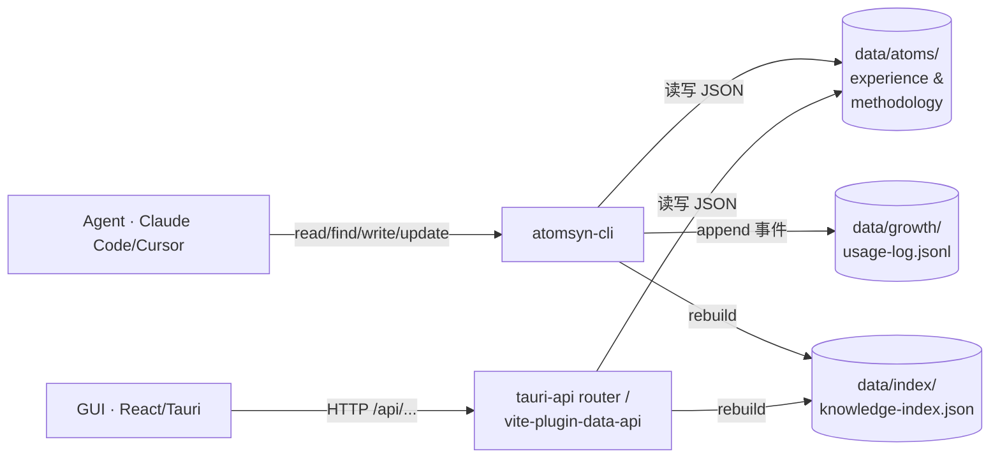
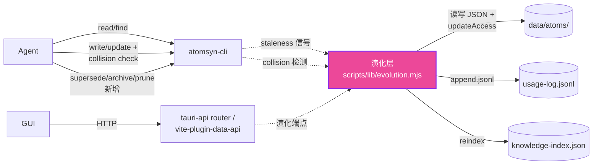
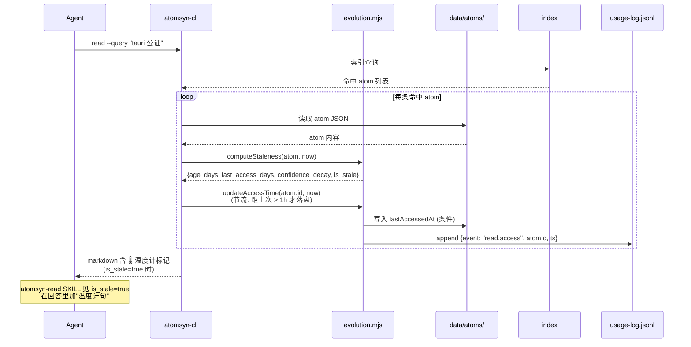
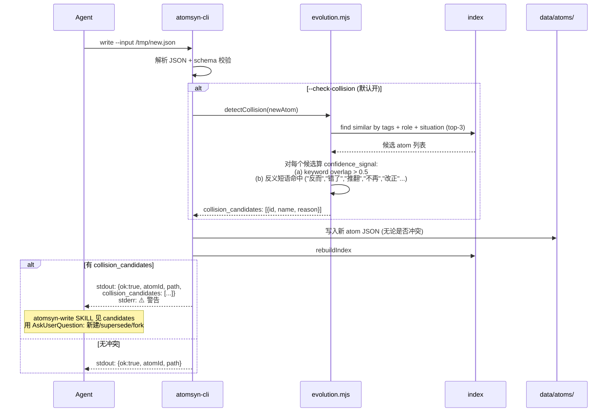
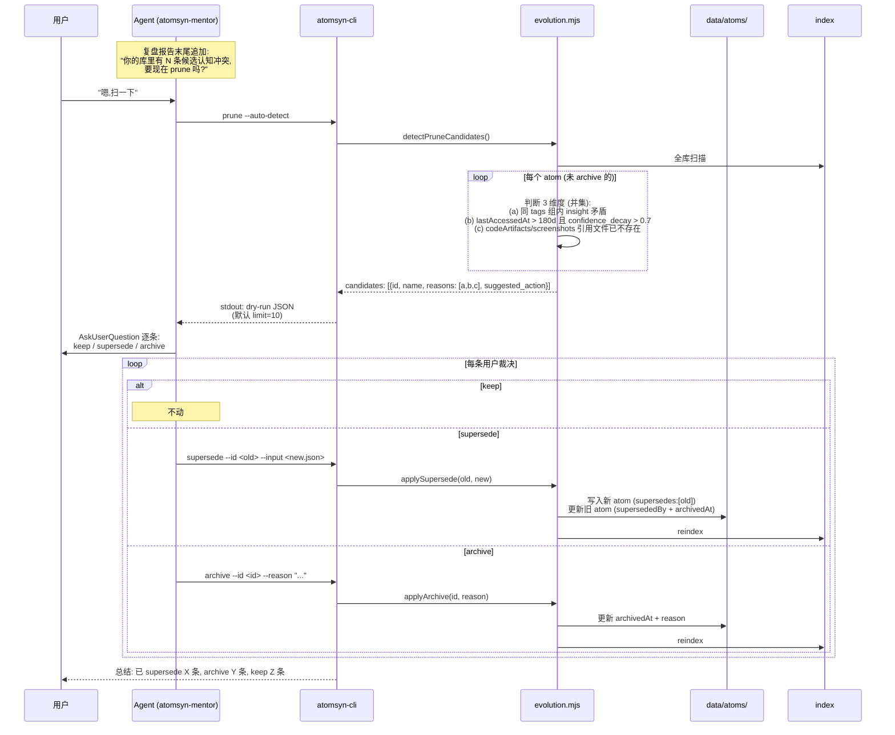

# Design · 2026-04-cognitive-evolution

> **上游**: `proposal.md` (本目录) · `docs/framing/v2.x-north-star.md` · `skills/atomsyn-{read,write,mentor}/SKILL.md`
> **状态**: draft
> **最后更新**: 2026-04-26

---

## 1 · 系统视图 (System View)

当前 read / write 路径,只有"添加"和"merge",没有时间感知和取代语义。



当前局限:
- atom JSON 没有 `supersededBy` / `archivedAt` / `lastAccessedAt` 字段
- read 输出只有匹配内容,没有 age 或 staleness 信号
- write 检测仅做 keyword find,不做 insight 语义对比
- 无 archive / supersede / prune 命令面

## 2 · 目标设计 (Target Design)

新增"演化层"(evolution module),在 CLI 内作为独立功能集,被 read/write 路径调用,被 supersede/archive/prune 命令直接驱动。



变化要点(粉色):
- 新增 `scripts/lib/evolution.mjs` 模块,封装 staleness 计算、collision detection、supersede 链维护
- `atomsyn-cli read/find` 命中时调演化层更新 `lastAccessedAt`(节流落盘) + 输出 staleness 字段
- `atomsyn-cli write/update` 在写入前调演化层做 collision check
- 新增 3 个 CLI 命令直接调演化层
- 数据 API 双通道增加 `/atoms/<id>/supersede` / `/atoms/<id>/archive` / `/atoms/prune` 端点

## 3 · 关键流程 (Key Flows)

### 3.1 流程 A · read 命中 → 输出 staleness 信号

触发点: Agent 调 `atomsyn-cli read --query "..."` 或 `find`。



**Staleness 计算公式 (v1)**:

```
age_days = floor((now - createdAt) / 86400_000)
last_access_days = lastAccessedAt 存在则 floor((now - lastAccessedAt) / 86400_000)
                   else age_days  // fallback

// 半衰期 180 天的指数衰减
base_decay = 1 - exp(-ln(2) * age_days / 180)

// locked 抗衰减:locked atom 的 decay 直接置 0
locked_factor = stats.locked ? 0 : 1

// 长期未访问加成:超 90 天没访问的 atom decay × 1.5(上限 1.0)
access_factor = last_access_days > 90 ? 1.5 : 1.0

confidence_decay = clamp(base_decay * locked_factor * access_factor, 0, 1)
is_stale = confidence_decay >= 0.5
```

**失败回退**: lastAccessedAt 写入失败(磁盘只读)→ 静默吞错,不影响 read 主流程返回内容;一次性 stderr 告警一次本会话。

**副作用**:
- atom JSON 的 `lastAccessedAt` 节流更新(距上次 > 1h)
- `usage-log.jsonl` 追加 `{event: "read.access", atomId, ts}` 一行
- 索引中的 lastAccessedAt 缓存同步更新(下次 reindex 落到 knowledge-index.json)

### 3.2 流程 B · write 触发 collision check

触发点: Agent 调 `atomsyn-cli write --input /tmp/x.json`(默认 `--check-collision`)。



**collision_candidates 字段格式**:

```json
{
  "ok": true,
  "atomId": "atom_exp_xxx_172800",
  "path": "/.../atom_exp_xxx_172800.json",
  "collision_candidates": [
    {
      "id": "atom_exp_old_id",
      "name": "旧 atom 标题",
      "score": 0.78,
      "reason": "tags 70% 重叠 + insight 含反义短语 '推翻'"
    }
  ],
  "hint": "本次写入已完成。如需取代旧 atom, 用 atomsyn-cli supersede --id <old> --input <这个文件>"
}
```

**关闭检测**: `atomsyn-cli write --no-check-collision` 或环境变量 `ATOMSYN_DISABLE_COLLISION_CHECK=1`。

**失败回退**: collision check 内部异常(索引未构建、IO 错误)→ 静默吞错,write 仍正常执行,stderr 一行 warning。

**副作用**: 同 write 原有副作用(写文件 + reindex + 追加 usage-log)+ 一行 `{event: "write.collision_detected", atomId, candidates: [...]}`(仅检测到时)。

### 3.3 流程 C · prune 全流程 (打破 → 重建)

触发点: 用户说"清理一下" / Agent 调用 mentor 在复盘报告末尾建议 → `atomsyn-cli prune --auto-detect`。



**铁律**: `prune` **永远不自动 mutate**。`--auto-detect` 只产出候选 JSON,所有 supersede/archive 必须经过用户对话确认 → Agent 调具体命令。这继承自 `/learn` 哲学。

**失败回退**:
- 候选检测过程中索引损坏 → stderr 报错,exit 1,不输出 candidates
- 用户裁决过程中某条 supersede 失败(目标 atom 已 locked)→ 单条失败不影响其他条,最终 summary 列出失败列表

**副作用**:
- dry-run 阶段: 仅读,无写
- 用户裁决阶段: 每条 supersede/archive 是独立 CLI 调用,各自 reindex + append usage-log

## 4 · 数据模型变更 (Data Model Changes)

### 4.1 受影响的 schema

| 文件 | 变更类型 | 摘要 |
|---|---|---|
| `skills/schemas/atom.schema.json` | additive | 新增 4 个可选字段 |
| `skills/schemas/experience-atom.schema.json` | additive | 同上(继承基类) |
| `skills/schemas/methodology-atom.schema.json` | additive | 同上 |
| `src/types/index.ts` | additive | TS 类型新增 4 个可选属性 |
| `data/index/knowledge-index.json` (生成产物) | additive | 索引项追加 archived / superseded 标记 |

### 4.2 字段 diff

```diff
{
  "id": "atom_exp_xxx",
  "schemaVersion": "1.5",
  "kind": "experience",
  "name": "...",
  "createdAt": "2025-10-01T00:00:00Z",
  "updatedAt": "2025-10-01T00:00:00Z",
+ "lastAccessedAt": "2026-04-20T10:30:00Z",   // ISO 8601, 由 read/find 命中时被动更新
+ "supersededBy": "atom_exp_yyy",              // 被哪个 atom 取代 (单值)
+ "supersedes": ["atom_exp_aaa", "atom_exp_bbb"],  // 取代了哪些 atom (数组,支持合并)
+ "archivedAt": "2026-04-20T11:00:00Z",        // ISO 8601 软删除时间戳
+ "archivedReason": "Apple 弃用 notarytool",   // 可选, 用户提供的归档理由
  "insight": "...",
  "tags": [...],
  "stats": {
    "locked": false,
    "userDemoted": false
  }
}
```

字段语义约束:
- `supersededBy` 与 `archivedAt` 必须**同时设置**(supersede 操作的不变量,archive 不强制 supersededBy)
- `supersedes` 数组是**单向链表**,反查通过 `supersededBy` 字段
- 一旦被 supersede 或 archive,该 atom **变为只读**(后续 update 会拒绝),只能通过 `archive --restore` 反归档
- `lastAccessedAt` 不参与 schema 校验的"必填"判断,纯辅助字段

### 4.2.1 Profile atom 的特殊语义 (D-008, 与 bootstrap-skill 联动)

profile atom (id=`atom_profile_main`, 单例, 由 bootstrap-skill change 引入) 在演化协议下有**特殊处理**:

| 字段 | 普通 atom 行为 | profile atom 行为 |
|---|---|---|
| `supersededBy` | 指向新 atom id | **不使用** (profile 是单例, 没有"新 id 取代旧 id") |
| `supersedes` | 数组列出取代了哪些旧 id | **不使用** (同上) |
| `archivedAt` | 软删除标志 | **可用** (用户主动归档整个画像, 罕见) |
| `lastAccessedAt` | read/find 命中时更新 | read/find/GUI 校准时都更新 |
| `previous_versions[]` | **不存在** | **存在** (来自 bootstrap-skill schema), 替代 supersede 链 |
| staleness 计算 | 标准公式 (见 D-006) | 标准公式 + 增加"距 verifiedAt 天数"作为额外因子 |

**演化路径** (与 bootstrap-skill D-010 协同):

```
profile 演化触发器:
  (a) bootstrap 重跑 (`atomsyn-cli bootstrap` 第二次)
  (b) 用户在 GUI 校准面板修改并提交 (POST /atoms/:id/calibrate-profile)
  (c) Agent 主动建议 (mentor v2: 检测到 declared vs inferred gap > 0.3)
  (d) 用户 GUI 时间线 restore 历史版本

每次触发时, CLI / API handler 内部:
  1. 加载现有 atom_profile_main.json
  2. 提取顶层 5 项: preferences / identity / knowledge_domains / recurring_patterns / evidence_atom_ids → 组装 snapshot
  3. 把 { version: N, supersededAt: now, snapshot, trigger, evidence_delta } 推入 previous_versions[] 顶部 (新→旧)
  4. 用新数据覆写顶层字段
  5. 更新 lastAccessedAt, 如是用户校准则更新 verifiedAt
  6. 写回单例文件
  7. reindex
```

**read 命中 profile 时的特殊行为** (本 change v1 不让 read 自动消费 profile, 只更新 lastAccessedAt):
- read 默认**不返回** profile atom (即便 query 命中), 因为 profile 不是给 LLM 当上下文的, 是给 GUI 显示的
- read 仅更新 profile.lastAccessedAt 用于 staleness 计算
- 例外: 用户显式 `atomsyn-cli read --include-profile` 才返回 profile (仅供 debug, v1 不暴露给 Skill)

### 4.3 旧数据兼容

**lazy 兼容,不写迁移脚本**:

- 旧 atom 没有 `lastAccessedAt` → staleness 计算 fallback 到 `createdAt`
- 旧 atom 没有 `archivedAt` / `supersededBy` → 视为"未归档"和"未被取代",参与所有读写
- 索引重建时若发现旧 atom 缺新字段,**不补默认值**,继续工作 — 只在 atom 被实际访问/修改时才写入新字段
- `npm run reindex` 跑完后,所有现有 atom 应通过新 schema 校验(因为新字段都是可选的)

**回退策略**: 如果新版本部署后发现致命问题,回滚到旧版本 CLI 后:
- 已写入的 `archivedAt` 字段会被旧版本忽略 → 已归档 atom 重新出现在 read 中(用户体验损失,但数据不丢)
- 已写入的 `supersededBy` 字段同上 → supersede 链失效但旧 atom 都还在
- 没有不可逆破坏

## 5 · 接口契约 (Interface Contracts)

### 5.1 atomsyn-cli

#### 5.1.1 修改: `read` / `find`

```
atomsyn-cli read --query "..." [--top N] [--show-history]
atomsyn-cli find --query "..." [--top N] [--with-taxonomy]
```

| 字段 | 类型 | 必填 | 说明 |
|---|---|---|---|
| --show-history | bool | 否 | 输出 supersede 链完整路径(默认只显示 1 级) |

输出新增字段(每条命中 atom):
```json
{
  "id": "...",
  "name": "...",
  "age_days": 178,
  "last_access_days": 45,
  "confidence_decay": 0.62,
  "is_stale": true,
  "supersededBy": null,
  "history": []  // --show-history 时填充
}
```

退出码: 0 成功 / 2 query 为空 / 1 其他错误。

副作用: 命中 atom 的 `lastAccessedAt` 节流更新;`usage-log.jsonl` 追加 `read.access` 事件。

#### 5.1.2 修改: `write` / `update`

```
atomsyn-cli write --input <file> [--check-collision | --no-check-collision]
atomsyn-cli update --id <id> --input <file> [--check-collision | --no-check-collision]
```

| 字段 | 类型 | 必填 | 说明 |
|---|---|---|---|
| --check-collision | bool | 否 | 默认 true。检测到冲突在 stdout 加 `collision_candidates`,stderr 警告,exit 仍为 0 |
| --no-check-collision | bool | 否 | 显式关闭 |

退出码: 0 成功(含检测到冲突)/ 2 schema 校验失败 / 3 atom locked / 1 其他错误。

副作用: 写文件 + reindex + 追加 usage-log;检测到冲突时追加 `write.collision_detected` 事件。

#### 5.1.3 新增: `supersede`

```
atomsyn-cli supersede --id <old-id> --input <new-atom-file> [--no-archive-old]
```

| 字段 | 类型 | 必填 | 说明 |
|---|---|---|---|
| --id | string | yes | 被取代的旧 atom id |
| --input | string | yes | 新 atom 的 JSON 文件路径(loose JSON,CLI 内部走 write 流程) |
| --no-archive-old | bool | 否 | 默认旧 atom 同时被 archive。设此 flag 则只设 supersededBy 不设 archivedAt(罕见,留给"我还想能 read 到旧版本"场景) |

执行步骤:
1. 校验旧 atom 存在且未 locked
2. 用 write 流程创建新 atom(含 schema 校验、collision check 跳过 — 显式 supersede 即承认冲突)
3. 设新 atom 的 `supersedes = [old-id]`(若旧 atom 已经有 supersedes 链,合并它的 supersedes 进新 atom)
4. 设旧 atom 的 `supersededBy = new-id` + `archivedAt = now`(除非 --no-archive-old)
5. 触发 reindex

退出码: 0 成功 / 2 旧 atom 不存在 / 3 旧 atom locked / 4 输入 JSON 校验失败 / 1 其他错误。

副作用: 新 atom 写入 + 旧 atom 修改 + reindex + usage-log 追加 `supersede.applied` 事件。

#### 5.1.4 新增: `archive`

```
atomsyn-cli archive --id <id> [--reason "..."] [--restore]
```

| 字段 | 类型 | 必填 | 说明 |
|---|---|---|---|
| --id | string | yes | 目标 atom id |
| --reason | string | 否 | 用户提供的归档理由,写入 `archivedReason` |
| --restore | bool | 否 | 反向归档:清空 archivedAt 和 archivedReason |

退出码: 0 成功 / 2 atom 不存在 / 3 atom locked(锁定的 atom 不能 archive,需先解锁)/ 1 其他错误。

副作用: 修改 atom 的 archivedAt + reindex + usage-log 追加 `archive.applied` / `archive.restored`。

#### 5.1.5 新增: `prune`

```
atomsyn-cli prune [--auto-detect] [--limit N] [--dry-run]
```

| 字段 | 类型 | 必填 | 说明 |
|---|---|---|---|
| --auto-detect | bool | 否 | 启用三维度并集检测(默认 true,显式提供更清晰) |
| --limit | int | 否 | 候选数上限(默认 10) |
| --dry-run | bool | 否 | **默认 true**。本命令不接受非 dry-run 模式 — 不会自动 mutate |

输出格式:
```json
{
  "ok": true,
  "candidates": [
    {
      "id": "atom_exp_xxx",
      "name": "...",
      "reasons": ["long-untouched", "low-confidence"],
      "age_days": 245,
      "confidence_decay": 0.81,
      "suggested_action": "archive"
    }
  ],
  "summary": {
    "total_atoms": 187,
    "candidates_count": 4,
    "by_reason": {"contradiction": 1, "long-untouched": 3, "broken-ref": 0}
  },
  "hint": "Use atomsyn-cli supersede / archive on each candidate after user review."
}
```

退出码: 0 成功(含 0 候选)/ 1 错误。

副作用: 仅读,无写。可选:`usage-log.jsonl` 追加 `prune.scanned` 事件用于观察使用频次。

### 5.2 数据 API (Vite 中间件 + Tauri 路由双通道)

| 方法 | 路径 | 请求体 | 响应 | 错误 |
|---|---|---|---|---|
| POST | `/atoms/:id/supersede` | `{newAtom: {...loose JSON}, archiveOld?: boolean}` | `{ok: true, oldId, newId, path}` | 404 旧不存在 / 423 locked / 400 校验失败 |
| POST | `/atoms/:id/archive` | `{reason?: string}` | `{ok: true, archivedAt}` | 404 / 423 |
| POST | `/atoms/:id/restore` | `{}` | `{ok: true, atomId}` | 404 / 400 (非已归档) |
| GET | `/atoms/prune-candidates?limit=N` | — | `{ok: true, candidates: [...], summary: {...}}` | 500 索引错误 |
| GET | `/atoms/:id/staleness` | — | `{age_days, last_access_days, confidence_decay, is_stale}` | 404 |

实现位置:
- Dev: `vite-plugin-data-api.ts` 新增路由分支
- Tauri: `src/lib/tauri-api/routes/atoms.ts` 扩展 + `src/lib/tauri-api/router.ts` 注册

写操作后必须 `rebuildIndex()`(D-005 决策的延伸)。

### 5.3 Skill 契约

#### atomsyn-read SKILL.md 变更

新增"温度计句"约定(在 Step 3 注入回答之前):

```markdown
### Step 2c · 检查 staleness 信号 (新增)

CLI 输出每条命中 atom 现在带 `is_stale` 字段。如果命中 atom 中有 `is_stale: true`:

1. 在生成回答时,对该 atom 内容追加一句"温度计句",自然语气,例如:
   - "你 N 个月前认为 X(`<atom_id>`),现在还成立吗?"
   - "这条经验距今已 N 天没被用过,值得在当前情境里再校准一次"
2. 不要硬性打断用户工作流,温度计句应是回答的自然延伸
3. 如果用户在后续对话里说"对,改一下"/"不,还是对的",Agent 顺势调:
   - "改一下" → atomsyn-cli supersede 或 update
   - "还是对的" → 提示用户在 GUI 里 lock 这条 atom 抗未来衰减

Token 预算: 每条温度计句 ≤ 30 tokens。
```

#### atomsyn-write SKILL.md 变更

新增"collision 决策三选一"步骤(在 Step 3 之后):

```markdown
### Step 3.5 · 处理 collision_candidates (新增)

如果 CLI write 的 stdout 含 collision_candidates 字段:

1. **不要重试 write**(写入已经成功)
2. 用 AskUserQuestion 三选一展示给用户:
   - 选项 A: "保留新建,旧的也留着" (默认,无后续操作)
   - 选项 B: "用新的取代旧的" → 调 atomsyn-cli supersede --id <old-id> --input <刚才的临时文件>。注意:这会创建第二条新 atom!所以更优做法是先 archive 刚才创建的新 atom,再 supersede 旧的。或者用流程 D(见下)
   - 选项 C: "并存 (fork)" — 本 change 不实现,告诉用户"fork 暂未支持,保持新建"
3. 流程 D · 干净 supersede(推荐):如果用户在 write 之前就已经怀疑会冲突,**先 find 找到旧 id**,**直接调 supersede 而不是 write**,避免双写问题
```

#### atomsyn-mentor SKILL.md 变更

在复盘报告末尾追加"主动 prune 建议"步骤:

```markdown
### Phase 3 · 主动 prune 建议 (新增)

生成复盘报告主体后,调用:

```bash
atomsyn-cli prune --auto-detect --limit 5
```

如果 candidates 数 ≥ 1,在报告末尾追加:

> ### 🧹 认知整理建议
> 你的库里有 N 条候选认知冲突或长期未触碰的 atom。要现在一条条裁决吗?
> (列出候选 atom 名 + reasons)

如果用户说"好",依次用 AskUserQuestion 让用户为每条选 keep / supersede / archive。

Token 预算: 单次复盘报告含 prune 建议时 ≤ 5000 tokens(原 3000 + prune 段 2000)。
```

## 6 · 决策矩阵 (Decision Matrix)

| # | 决策点 | 选项 | 利 | 弊 | 选哪个 | 为什么 |
|---|---|---|---|---|---|---|
| D1 | 删除语义 | 硬删除 / 软删除 (archive) | 硬:直观;软:可逆 | 硬:违反铁律;软:磁盘占用 | **软删除** | 铁律 + 学习轨迹保留 |
| D2 | 取代语义 | merge only / + supersede / + supersede + fork | merge:简单;sup:打破→重建;fork:更全 | merge:无法演化;fork:复杂度爆炸 | **+ supersede** | 用户原话 三选一选定 |
| D3 | staleness 触发器 | 主动(Agent调用) / 被动(CLI在read时) | 主动:精确;被动:零成本 | 主动:Agent 不会调;被动:每次读都更新 | **被动** | 主动哲学一致性,见 D-004 |
| D4 | collision 检测算法 v1 | 关键词重叠 / embedding / LLM | 关键词:简单快;embed:准;LLM:最准 | 关键词:粗;embed:增依赖;LLM:慢 + 隐私 | **关键词重叠 + 反义短语库** | v1 启发式打通,后续可升级 |
| D5 | prune 自动化程度 | 全自动 mutate / 仅候选 dry-run / 人工 review 后批量 | 全自动:省事;dry-run:安全;批量:效率 | 全自动:违反 /learn 哲学 | **仅 dry-run + AskUserQuestion 逐条** | 永不自动改库,见 D-005 |
| D6 | confidence_decay 公式 | 线性 / 指数(半衰期) / 自定义可调 | 线性:简单;指数:符合学习曲线;可调:灵活 | 自定义:配置噪声 | **指数,半衰期 180 天** | 学习半衰期与人类记忆研究一致 |
| D7 | lastAccessedAt 写入策略 | 每次 read 立即写 / 节流写 / 仅内存索引 | 立即:精确;节流:减抖动;仅内存:零开销 | 立即:磁盘抖动;仅内存:重启丢失 | **节流(> 1h 才落盘) + 内存即时** | 平衡精度与抖动,见风险2 |
| D8 | supersede 时旧 atom 是否自动 archive | 默认是 / 默认否 / 强制是 | 是:语义清;否:灵活;强制:一刀切 | 默认是 + flag 关:覆盖最广 | **默认 archive,--no-archive-old 关闭** | 95% 场景下取代 = 归档旧的 |

## 7 · 安全与隐私 (Security & Privacy)

- **数据流向**: 100% 本地。新字段(supersededBy / archivedAt / lastAccessedAt)和现有字段一样,只在用户磁盘上读写,不出本地。
- **敏感字段**: `archivedReason` 可能含用户主观叙述(如"Apple 在 X 日期改了 API 我来不及改"),仍只在本地。LLM 调用(用于 mentor 报告生成)不会单独 sink archivedReason 给云端 — 它只作为 atom JSON 的一部分被读出,用户在使用 Cursor / Claude Code 等远程 LLM 时才可能进入 prompt(继承现有边界)。
- **LLM prompt 隐私边界**: 本 change 不引入新的 LLM 调用。staleness 计算和 collision detection 都在 CLI 内本地完成。mentor 的 prune 建议是"基于 dry-run 候选生成中文文案",这一步沿用现有 mentor SKILL 的 LLM 路径,不增加新边界。
- **archive 不等于隐藏隐私**: 用户应该明白 archived atom 仍在磁盘上、仍在索引里(仅 read 默认不返)。如果用户想真正"删除敏感内容",应在 GUI 里 unlock + 手动文件删除。本 change 在 archive 命令的 stdout 中提示这一点。

## 8 · 性能与规模 (Performance & Scale)

| 维度 | 当前 | 预期上限 | 是否需要分页/分批 |
|---|---|---|---|
| atom 数 | ~200 | ~5000 | prune dry-run 默认 limit 10,无需分页 |
| read 命中后 staleness 计算 | 不存在 | < 1ms / atom | 否 |
| lastAccessedAt 落盘频率 | 0 | ~5000 atom × 1次/h = 5000 次/h 上限 | 节流(distance > 1h)实际 < 100 次/h |
| collision check 延迟 | 不存在 | < 50ms / write | 否(top-3 候选,关键词重叠 O(n)) |
| prune 全库扫描 | 不存在 | 200 atom × 3 维度 ~ 100ms / 5000 atom × 3 维度 ~ 2.5s | 5000 量级时考虑增量扫描(后续 change) |
| 索引文件大小 | ~100KB | ~2.5MB(5000 atom × 增 4 字段) | 否 |
| usage-log.jsonl 增长 | append-only | read.access 事件每会话 ~10 条 ~ 1KB,30 天 ~ 30MB | 已有日志轮转计划(超出本 change 范围) |

时延预算:
- read 命中输出 staleness 信号:用户感知 < 200ms 不变(staleness 计算嵌入索引查询,不增加 IO)
- write collision check:< 100ms 不影响主流程
- prune dry-run:< 3s(5000 atom 量级),用户主动触发,可接受
- supersede / archive:< 200ms(单 atom 修改 + reindex),与现有 update 一致

## 9 · 可观测性 (Observability)

- **事件日志**: 所有新事件追加到 `data/growth/usage-log.jsonl`
  - `read.access` `{atomId, ts}` — 每次 read 命中
  - `read.staleness_emitted` `{atomId, decay, is_stale}` — is_stale=true 时
  - `write.collision_detected` `{atomId, candidates: [...]}` — 检测到冲突时
  - `supersede.applied` `{oldId, newId, archivedOld: bool}`
  - `archive.applied` `{atomId, reason}`
  - `archive.restored` `{atomId}`
  - `prune.scanned` `{candidates_count, summary}` — prune dry-run 触发
- **错误反馈**:
  - 用户可见错误来自 stderr。每条错误都有清晰的提示语(如"atom is locked",会附带"如需 supersede 请先 unlock")
  - lastAccessedAt 写失败 → 会话内首次告警一行,后续静默
- **回退路径**:
  - read 主流程失败:不应该被 staleness 计算阻塞,任何异常都吞错回退到原行为
  - write collision check 异常:write 主流程继续,stderr 一行 warning
  - supersede 中途失败:旧 atom 不修改 + 新 atom 不写入(原子性),错误回滚
- **调试入口**:
  - `ATOMSYN_DEBUG=1` 环境变量 → CLI 在 stderr 打印演化层每步骤
  - GUI 在 Settings → Diagnostics 页加"演化日志"区,显示最近 50 条 evolution 事件(后续 change,本次先打通日志通道)

## 10 · 兼容性与迁移 (Compatibility & Migration)

| 场景 | 处理方式 |
|---|---|
| 全新用户 | 默认启用,无需配置。第一次 write 起 lastAccessedAt / archivedAt 等字段就会出现 |
| 老用户已有数据 | **lazy migration**: 旧 atom 缺新字段视为正常,只在被访问/修改时才写入。`npm run reindex` 跑完后所有现有 atom 通过校验 |
| 索引格式 | knowledge-index.json 新增字段是 additive,旧 GUI 读到时多余字段忽略,不报错 |
| 出错回退 | 回滚到旧 CLI 后:archived atom 重新出现在 read(用户体验损失);supersede 链失效但旧 atom 都还在(数据不丢) |
| Skill 升级 | 三个 skill 的 SKILL.md 通过 `atomsyn-cli install-skill` 全量替换,无 migration |

灰度策略:不需要 feature flag。新字段全可选,新命令是 additive,现有命令向后兼容。`--no-check-collision` 是给老脚本/CI 的逃生口。

升级路径:用户 `npm install` 升级到含本 change 的版本后,无感生效。GUI 中第一次访问归档相关界面会看到"目前 0 条已归档"。

## 11 · 验证策略 (Verification Strategy)

- **自动化测试** (在 `scripts/__tests__/` 下新增,用 Node native test runner 或现有测试栈):
  - `evolution.staleness.test.mjs` — 覆盖公式 6 种 case(刚创建 / 90 天 / 180 天 / 365 天 / locked / 长期未访问)
  - `evolution.collision.test.mjs` — 覆盖 5 个反义短语短句 + 3 个非反义 keyword overlap > 0.7 的 case
  - `evolution.supersede.test.mjs` — 1 级 / 2 级 / 3 级 supersede 链的写入 + 反查
  - `cli.archive-restore.test.mjs` — archive 后 read 不返 / restore 后 read 返 / locked atom 拒绝
  - `cli.prune.test.mjs` — 三维度并集逻辑 + dry-run 输出格式
- **手动 dogfood 场景** (端到端):
  1. 用户在 Cursor 开新会话,提一个旧 atom 命中的话题 → atomsyn-read 应自然抛出温度计句
  2. 用户回复"对,我现在认为 X 改了" → Agent 应主动建议 supersede,用户确认后调 CLI
  3. 数月后用户运行 mentor 复盘 → 复盘报告末尾应有 prune 建议
  4. 用户裁决候选,选择 archive 一条 → read 默认不再返;archive --restore 后能找回
  5. 用户故意写两条强冲突的新 atom → 第二次 write 应触发 collision_candidates
- **关键不变量**:
  - 现有 ~200 atom JSON 在新 schema 下 100% 通过校验
  - read / find / write / update / get 在不带新参数时输出格式与历史完全一致(只新增字段)
  - locked atom 不可被 archive / supersede(继承既有 lock 语义)
  - Tauri 打包模式与 Vite dev 模式行为完全一致(双通道平等)

## 12 · Open Questions

### 已解决 (RESOLVED 2026-04-26)

- [x] ~~bootstrap-skill OQ-6 · cognitive-evolution 与 bootstrap 的 confidence 接口对接~~ → **已决 (D-008)**: profile atom 享受演化协议但用 `previous_versions[]` 替代 supersede 链; staleness 公式增加 verifiedAt 因子; bootstrap 写入的 imported atom 默认 `confidence=0.5` + `lastAccessedAt=null`, staleness 用 createdAt 兜底, 防止"刚 import 立即被标 stale"

### 待澄清

- [ ] confidence_decay 半衰期 180 天是否合适?需要在 dogfood 30 天后回看 staleness 标记的实际命中率,如果误标率 > 30% 需要调到 270 天 — **谁来回答**: 用户 + 主 agent 在 dogfood 期 / **何时回答**: 实施后第 30 天复盘
- [ ] prune 三维度的并集是否会产生太多候选(> 20 条)从而让用户疲劳? — **谁来回答**: 主 agent 通过 dry-run 跑现有 200 atom 看候选数 / **何时回答**: 实施 §6 任务时(B5)
- [ ] supersede 时新 atom 是否允许跨 framework / cell?(旧 atom 在 jtbd cell, 新 atom 在 voc cell) — **倾向**: 允许,因为认知演化可能跨语境;但要求新 atom 路径对应它自己的 cell — **谁来回答**: 主 agent / **何时回答**: design B 阶段实现 supersede 时
- [ ] archive 后被 supersede 链引用的 atom 在 GUI 怎么显示?(用户能看到"这条已归档,但还有 1 条新版本基于它")—— **谁来回答**: 后续 GUI change / **何时回答**: 本 change 不解决,标 out-of-scope
- [ ] profile.previous_versions[] 数组无限增长时的 prune 策略 (软上限多少 / GUI 引导用户清理 / 自动归档老旧版本到外部 jsonl) — **谁来回答**: 用户 / **何时回答**: bootstrap-skill 实施 dogfood 后 30 天
