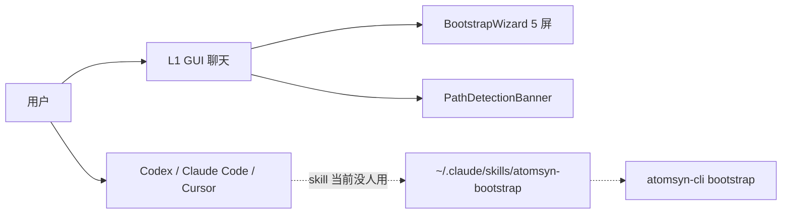
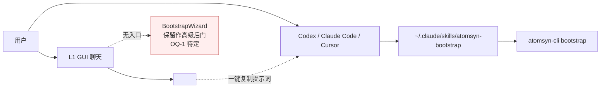

# Design · 2026-04-chat-as-portal

> **上游**: `proposal.md` (本目录) · `docs/framing/v2.x-north-star.md` §1+§6 · 已归档 `openspec/archive/2026/04/2026-04-bootstrap-tools/design.md`
> **状态**: **draft (skeleton)** — 新会话 review proposal 后填具体内容
> **最后更新**: 2026-04-28

---

> **怎么读这份文档** (新会话):
>
> 本文当前是**骨架**, 详细设计未填。proposal.md 已锁定 WHY+WHAT, 设计阶段需要回答 HOW 的具体细节。展开顺序按 _template/design.md 的章节顺序进行 (§1 系统视图 → §2 目标设计 → … → §11 验证策略 → §12 Open Questions)。
>
> **关键耦合**:
> - 本 change 的 L2 接口完全复用 `bootstrap-tools` / `bootstrap-skill` 已交付的 SKILL.md + atomsyn-cli surface, 不重做
> - L1 改动是**减法 + 替换**: 移除 PathDetectionBanner / `/bootstrap` 命令 (改语义) / atomsyn:open-bootstrap 监听; 加 `<ExternalAgentHandoffCard>` + `[[handoff:...|{...}]]` markdown action; AGENTS.md 调整
> - **B 组 (L2 真实可用性验证) 必须先于 A 组 (L1 减负)** — 见 proposal §7 R1, 否则 atomsyn 无后路

---

## 1 · 系统视图 (System View)

> 当前 (bootstrap-tools 已交付):
>
> [TODO] 画出 L1 GUI 聊天 + ChatInput / SkillCommandPalette / PathDetectionBanner / BootstrapWizard / atomsyn:open-bootstrap 事件链 → useBootstrapStore → BootstrapWizard 5 屏 → CLI 命令拷贝 → 用户切终端跑
>
> 同时画 L2 链 (atomsyn-cli + skill 安装到 ~/.claude/skills/) — 当前用户感知不到, 因为没有引导

## 2 · 目标设计 (Target Design)

> 本 change 完成后:

[TODO] 完成详细对比图

## 3 · 关键流程 (Key Flows)

### 3.1 流程 A · 用户在 L1 聊天发"导入" 触发引导卡片

[TODO] sequence diagram: 用户输入 → GUI LLM (chatLlmClient.streamChat) 看 AGENTS.md 触发段 → 输出 `[[handoff:bootstrap|{...}]]` → MarkdownRenderer 识别 → 渲染 ExternalAgentHandoffCard → 用户点 "复制提示词" → clipboard 写入 → 用户切到 Cursor 粘贴

### 3.2 流程 B · 用户在 Cursor 触发 atomsyn-bootstrap skill

[TODO] sequence diagram: 用户在 Cursor 发提示词 → Cursor skill selector 命中 atomsyn-bootstrap → 加载 SKILL.md → Cursor Agent 走 dry-run/commit 两步 → 调 atomsyn-cli bootstrap → 落 atom

### 3.3 流程 C · BootstrapWizard 高级后门 (OQ-1 = ii 时)

[TODO] sequence diagram: 用户从 Settings / Atlas 某处入口找到 Wizard (聊天页不再入口) → 仍走 v2 dry-run/commit → 适合 power user

## 4 · 数据模型变更

**无 schema 变更**。本 change 是定位调整 + 入口替换, 不动数据。

session.json / atom.schema.json / profile-atom.schema.json 全部沿用 bootstrap-tools / bootstrap-skill 已交付版本。

## 5 · 接口契约

### 5.1 atomsyn-cli

**无变更**。bootstrap / write / read / mentor 4 个子命令全 surface 沿用。仅:

- [ ] [TODO] 是否新增 `atomsyn-cli skill-test` 子命令模拟外部 Agent 调用 SKILL.md 评估描述匹配度? — proposal OQ-7, 需评估工程量

### 5.2 数据 API

**无变更**。所有 API 端点沿用。

### 5.3 Skill 契约

[TODO] 加新不变量到 specs/skill-contract.md:

- **G-I1 · L1 不实现 skill 重流程**: GUI 聊天页不应试图在 L1 内复刻 atomsyn-bootstrap / write / mentor 的执行链路 (扫盘/解析/LLM tool-use loop), 这些重流程归 L2 (CLI + Skill + 外部成熟 Agent). L1 仅做 *引导* + *与库内已有 atom 互动*

### 5.4 GUI 组件契约

[TODO] 详细设计:

- `<ExternalAgentHandoffCard>` props: `{ task, prompt, skill, recommendedAgent }` — render Linear-风格卡片
- `MarkdownRenderer` 新 action: `[[handoff:<task>|<json>]]`
- `AGENTS.md` 增加段: 用户消息匹配 "导入 / 倒进 / bootstrap / 沉淀这批 / 把这个目录" 时输出 handoff 卡片

## 6 · 决策矩阵

[TODO] 待 review 阶段决定:

| # | 决策点 | 选项 | 选哪个 | 理由 |
|---|---|---|---|---|
| D1 | BootstrapWizard 命运 | 删除 / 保留作高级后门 | OQ-1 | [TODO] |
| D2 | `/bootstrap` 命令命运 | 删除 / 改语义为引导卡片 | OQ-3 | [TODO] |
| D3 | PathDetectionBanner 命运 | 删除 / 改用途 | OQ-4 | [TODO] |
| D4 | L2 验证不通过的 fallback | 加 GUI tool-use 兜底 / 不做 | OQ-6 | [TODO] |
| D5 | 触发率测试方法 | atomsyn-cli skill-test 子命令 / 手动跑 | OQ-7 | [TODO] |
| D6 | 推荐外部 Agent 优先级 | Cursor / Claude Code / Codex / Claude.ai 怎么排序 | OQ-5 | [TODO] |

## 7 · 安全与隐私

[TODO] 重点:

- handoff 卡片"一键复制提示词" 把用户文件路径写入剪贴板, 是否有泄露风险? (剪贴板可能被其他应用读到)
- L2 在外部 Agent 跑时, 用户的 ATOMSYN_LLM_API_KEY 与 Codex/Claude Code 自带的 LLM key 是分开的, 文档需明确

## 8 · 性能与规模

[TODO] handoff 卡片是纯 UI render, 0 性能影响。L2 触发 → atomsyn-cli 性能与 bootstrap-tools 一致 (无变化).

## 9 · 可观测性

[TODO]
- 新增 usage-log 事件? `chat.handoff_card_shown` / `chat.handoff_copied` (反映 L2 引导转化)?
- 是否需要新 telemetry 来量化"用户从 L1 引导卡片走到 L2 实际触发"的转化率?

## 10 · 兼容性与迁移

[TODO]
- 已经习惯 L1 BootstrapWizard 的早期用户 (本人) 升级后体验变化提示
- 是否给 BootstrapWizard 入口转移设计 deprecation 提示

## 11 · 验证策略

[TODO]
- B 组实测: 5 个真实用户场景 × 4 个 skill × 2 个外部 Agent = 40 个测试点, 触发率 ≥ 80%
- L1 减负: 视觉 + 操作步数计数 (从 GUI 打开到知道去 Cursor 跑 ≤ 2 步)
- 用户指南可读性: 第三方未读过 atomsyn 文档的人按指南操作 5 分钟跑通

## 12 · Open Questions

参见 proposal.md §7 待澄清 OQ-1 ~ OQ-7。设计阶段必须先解决 OQ-1 / OQ-3 / OQ-6 这 3 个核心架构选择, 才能进入 implement 阶段。

---

> **下一步**: 与用户 review proposal → 锁定 OQ-1/OQ-3/OQ-6 → 回填本 design.md 各章节 → 状态从 draft → reviewed → locked → 进入 implement (tasks.md)
