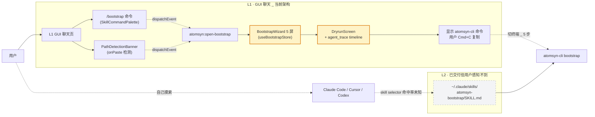
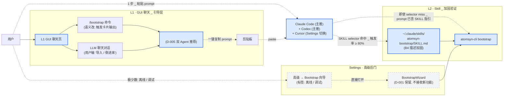
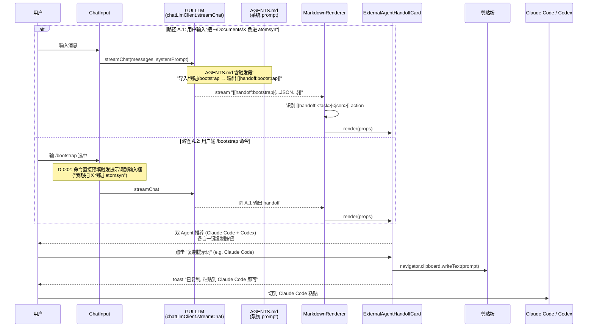
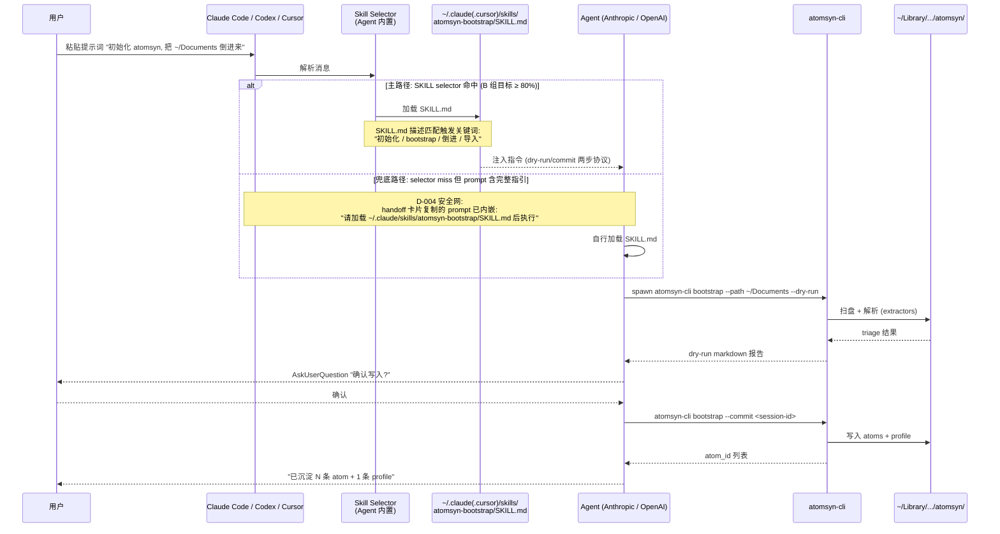
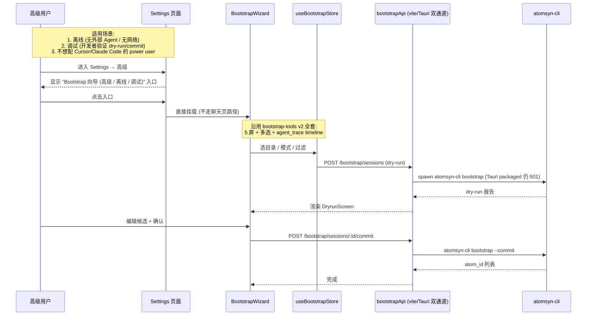

# Design · 2026-04-chat-as-portal

> **上游**: `proposal.md` (本目录) · `docs/framing/v2.x-north-star.md` §1+§6 · 已归档 `openspec/archive/2026/04/2026-04-bootstrap-tools/design.md`
> **状态**: **locked** — 7 个 OQ (D-001 ~ D-007) 全部 accepted, 详细章节填充完成. 进入 implement 阶段.
> **最后更新**: 2026-04-28 · 用户拍板 D-001~D-007 全部决策, design 锁定

---

> **怎么读这份文档** (新会话):
>
> 本文当前是**骨架**, 详细设计未填。proposal.md 已锁定 WHY+WHAT, 设计阶段需要回答 HOW 的具体细节。展开顺序按 _template/design.md 的章节顺序进行 (§1 系统视图 → §2 目标设计 → … → §11 验证策略 → §12 Open Questions)。
>
> **关键耦合**:
> - 本 change 的 L2 接口完全复用 `bootstrap-tools` / `bootstrap-skill` 已交付的 SKILL.md + atomsyn-cli surface, 不重做
> - L1 改动是**减法 + 替换**: 移除 PathDetectionBanner / `/bootstrap` 命令 (改语义) / atomsyn:open-bootstrap 监听; 加 `<ExternalAgentHandoffCard>` + `[[handoff:...|{...}]]` markdown action; AGENTS.md 调整
> - **B 组 (L2 真实可用性验证) 必须先于 A 组 (L1 减负)** — 见 proposal §7 R1, 否则 atomsyn 无后路

---

## 1 · 系统视图 (当前 · bootstrap-tools 已交付)



**核心问题**:
- L1 重流程 (Wizard 5 屏) 与外部成熟 Agent 直接竞争且必输
- L2 虽已就位, 但用户感知不到入口, 触发率未验证
- 用户从聊天到完成 bootstrap = 5 步 (`/bootstrap` → 选目录 → dry-run → 切终端复制命令 → 跑命令)

## 2 · 目标设计 (本 change 后)



**关键改动对比**:

| 维度 | 当前 | 目标 |
|---|---|---|
| 聊天页 bootstrap 入口 | `/bootstrap` 命令 + PathDetectionBanner + atomsyn:open-bootstrap 事件 | 仅 `/bootstrap` 命令 (改语义为输出 handoff 卡片), Banner 删除, 事件链移除 |
| 用户操作步数 (L1 → 完成 bootstrap) | 5 步 | 2 步 (聊天发"导入" → 卡片复制 prompt 粘贴 Cursor/Claude Code 跑) |
| BootstrapWizard 触达 | 聊天页主路径 | Settings 高级后门 (离线 / 调试) |
| L2 用户可见性 | 无 (skill 安装但用户不知道) | handoff 卡片显式推荐 + 安装命令 + 触发话术 |
| 推荐外部 Agent | 无 | Claude Code + Codex 双推 (D-005), Settings 可改 |
| 触发率验证 | 未做 | 60 测试点手动矩阵 (D-006) ≥ 80% |

## 3 · 关键流程 (Key Flows)

### 3.1 流程 A · 用户在 L1 聊天发"导入"触发引导卡片 (主路径)



**关键设计点**:
- `[[handoff:<task>|<json>]]` 与现有 `[[ingest:confirm|{...}]]` 是同一套 markdown action 机制 (MarkdownRenderer.tsx 现成)
- AGENTS.md 触发段必须明确告诉 LLM **输出卡片而不是自己执行** — 防止 LLM 假装能跑 bootstrap
- 一键复制后用户**仍可在 atomsyn GUI 看到聊天历史**, 跑完 Cursor 后回来可以继续问"我刚 import 的怎么样" → atomsyn-mentor / atomsyn-read 接力

### 3.2 流程 B · 用户在外部 Agent 触发 atomsyn-bootstrap skill



**关键设计点**:
- `--target codex` 安装路径在 design §5.1 中澄清 (当前 atomsyn-cli install-skill 只支持 claude + cursor, B 组前需补)
- 兜底路径的关键: handoff 卡片的 prompt 必须**显式包含**"加载 SKILL.md"指引, 不能只发触发关键词
- AskUserQuestion 关卡是 SKILL.md 已实现的契约, 外部 Agent 只是执行 — atomsyn 不需要在 L2 重新实现交互逻辑

### 3.3 流程 C · 高级用户走 Settings 后门 (BootstrapWizard)



**关键设计点**:
- BootstrapWizard 不接收新功能 (D-001 后果), 仅 bug fix; UI 不需要重新打磨
- Settings 入口标签必须明确"高级 / 离线 / 调试" — 不让普通用户误入
- packaged Tauri 的 commit 501 限制保持现状 (与 bootstrap-skill 已记录的 caveat 一致), 不在本 change 修复

## 4 · 数据模型变更

**无 schema 变更**。本 change 是定位调整 + 入口替换, 不动数据。

session.json / atom.schema.json / profile-atom.schema.json 全部沿用 bootstrap-tools / bootstrap-skill 已交付版本。

## 5 · 接口契约

### 5.1 atomsyn-cli

**核心命令面无变更** (bootstrap / write / read / mentor / supersede / archive / prune / reindex / where 全 surface 沿用).

**install-skill 子命令扩展** (B1 已实施, D-005 触发):

```
atomsyn-cli install-skill --target <claude|cursor|codex|all>
```

**Codex CLI skill 加载路径** (B1.1 调研结果, 来源 https://developers.openai.com/codex/skills):
- 用户级全局 (跨 repo): **`~/.agents/skills/<skill-name>/SKILL.md`** ← atomsyn-cli 选这个
- 项目级 (单 repo): `<project>/.agents/skills/<skill-name>/SKILL.md` (本 change 不涉及)
- 不是 `~/.codex/skills/` (那是 Codex 内置目录) — 容易混淆, 文档 + cli usage 已加注释

**三家 target 安装路径汇总**:

| Target | 安装路径 | 说明 |
|---|---|---|
| `claude` | `~/.claude/skills/<skill-name>/SKILL.md` | Anthropic Claude Code |
| `cursor` | `~/.cursor/skills/<skill-name>/SKILL.md` | Cursor IDE |
| `codex` | `~/.agents/skills/<skill-name>/SKILL.md` | OpenAI Codex CLI (B1 新增) |
| `all` | 三家全装 | 默认推荐 (atomsyn-cli usage doc) |

**`atomsyn-cli where` 输出扩展** (B1.4 已实施): 顶层 path/source/exists 保持向后兼容 (cli-regression 依赖), additive 新增 `cliShim` (shim 路径 + installed) + `skills` (各 target 目录存在 + 4 个 skill 安装状态), 帮用户定位 skill 是否就位.

**install-skill 不写**: D-006 触发率测试用手动跑, 不写 `atomsyn-cli skill-test` 子命令.

### 5.2 数据 API

**无变更**。所有 API 端点沿用。

### 5.3 Skill 契约

[TODO] 加新不变量到 specs/skill-contract.md:

- **G-I1 · L1 不实现 skill 重流程**: GUI 聊天页不应试图在 L1 内复刻 atomsyn-bootstrap / write / mentor 的执行链路 (扫盘/解析/LLM tool-use loop), 这些重流程归 L2 (CLI + Skill + 外部成熟 Agent). L1 仅做 *引导* + *与库内已有 atom 互动*

### 5.4 GUI 组件契约

#### 5.4.1 `<ExternalAgentHandoffCard>` 组件

**位置**: `src/components/chat/ExternalAgentHandoffCard.tsx` (新文件)

**Props 契约** (D-005 双 Agent + D-007 视觉):

```ts
export type HandoffTask = 'bootstrap' | 'write' | 'read' | 'mentor'

export type AgentId = 'claude-code' | 'codex' | 'cursor' | 'claude-desktop'

export interface AgentRecommendation {
  id: AgentId
  label: string                    // 渲染显示名 (e.g. "Claude Code")
  prompt: string                   // 完整提示词 (内嵌 SKILL.md 加载指引, 见 D-004 安全网)
  installHint?: string             // 安装命令 (e.g. "atomsyn-cli install-skill --target claude")
  docsUrl?: string                 // 用户指南锚点
}

export interface ExternalAgentHandoffCardProps {
  task: HandoffTask
  skill: string                    // e.g. 'atomsyn-bootstrap'
  agents: AgentRecommendation[]    // 默认 [claude-code, codex] (D-005)
  className?: string
}
```

**渲染契约** (复用 atom-card.html 玻璃态):
- 容器: `rounded-2xl border bg-white/60 dark:bg-zinc-900/60 backdrop-blur-md p-5`
- 入场动画: Framer Motion `initial={{ opacity: 0, y: 8 }} animate={{ opacity: 1, y: 0 }}` + spring `cubic-bezier(0.16, 1, 0.3, 1)`
- 内部布局:
  ```
  ┌─────────────────────────────────────┐
  │  ✨ atomsyn-bootstrap               │  ← skill 名称 + 任务类型 (Inter 16px semibold)
  │  在外部 Agent 中执行                 │  ← 副标题 (Inter 13px text-zinc-500)
  ├─────────────────────────────────────┤
  │  🔮 Claude Code (推荐)              │  ← agents[0]
  │  完整 prompt 预览 (折叠首 2 行)      │  ← JetBrains Mono 12px bg-zinc-50
  │  [一键复制] [安装 SKILL] [文档]     │
  ├─────────────────────────────────────┤
  │  🤖 Codex (推荐)                    │  ← agents[1]
  │  完整 prompt 预览 (折叠首 2 行)      │
  │  [一键复制] [安装 SKILL] [文档]     │
  └─────────────────────────────────────┘
  ```
- 一键复制实现: `navigator.clipboard.writeText(prompt)` + 短暂 toast "已复制, 粘贴到 <Agent> 即可"
- 一键复制后**不**自动切窗口 (Tauri 跨进程切窗体验差, 让用户主动切更可控)

#### 5.4.2 `MarkdownRenderer` 新 action

**位置**: `src/components/chat/MarkdownRenderer.tsx` (扩展现有文件)

**新增 action 语法**: `[[handoff:<task>|<json>]]`

**与现有 action 对齐**:
- 现有 `[[atom:<id>|<label>]]` → AtomCard
- 现有 `[[ingest:confirm|<json>]]` → IngestConfirmCard
- **新增** `[[handoff:<task>|<json>]]` → ExternalAgentHandoffCard

**JSON payload 示例**:
```json
{
  "task": "bootstrap",
  "skill": "atomsyn-bootstrap",
  "agents": [
    {
      "id": "claude-code",
      "label": "Claude Code",
      "prompt": "请加载 ~/.claude/skills/atomsyn-bootstrap/SKILL.md, 然后帮我把 ~/Documents 目录倒进 atomsyn 知识库。走 dry-run + commit 两步。",
      "installHint": "atomsyn-cli install-skill --target claude",
      "docsUrl": "/docs/guide/external-agent-integration.md#claude-code"
    },
    {
      "id": "codex",
      "label": "Codex",
      "prompt": "...",
      "installHint": "atomsyn-cli install-skill --target codex",
      "docsUrl": "/docs/guide/external-agent-integration.md#codex"
    }
  ]
}
```

**错误兜底**: JSON parse 失败时 fallback 到原始 markdown 显示 (与现有 ingest:confirm 一致).

#### 5.4.3 `AGENTS.md` 触发段扩展

**位置**: `~/Library/Application Support/atomsyn/chat/AGENTS.md` (用户私有) + 项目内 seed (供 reset 用)

**新增段** (替代当前 atomsyn-bootstrap 描述, 当前文件没明确这一段, 是新增):

```markdown
### 🚀 atomsyn-bootstrap (引导外部 Agent 执行)

- **触发信号**: 用户消息匹配以下意图 (中英文同义):
  - "导入 / 倒进 / 把 X 倒进来 / 沉淀这批 / 初始化 atomsyn / bootstrap"
  - "把 ~/Documents 倒进 atomsyn / import this folder"
  - 用户输入 `/bootstrap` 命令 (D-002, 命令面板预填)
- **行为**: **不要假装能做** bootstrap 重流程. atomsyn GUI 内置 LLM 不具备 tool-use 扫盘能力, 这件事必须通过外部成熟 Agent (Claude Code / Codex / Cursor) 执行.
- **输出**: `[[handoff:bootstrap|{...}]]` action 卡片, 包含针对 Claude Code + Codex 的双推荐提示词
- **铁律**: 永远输出 handoff 卡片, 永远不要尝试输出 markdown 报告"假装"完成 bootstrap

#### 输出示例

用户: "把 ~/Documents/混沌 倒进 atomsyn"

回复:
> 我帮你准备好了在外部 Agent 里跑 bootstrap 的指引. 选一个你常用的工具:
>
> [[handoff:bootstrap|{...JSON...}]]
>
> 跑完后回来这里, 我可以帮你看新沉淀的 atom (用 /read 或问"我刚 import 了什么").
```

**与现有 atomsyn-write 区别**: write 是用户**已经在 GUI 里说了 1-2 句洞察**, 直接构造 ingest 卡片; bootstrap 是**批量从硬盘扫**, 必须外部 Agent 跑.

## 6 · 决策矩阵 (全部已拍板, 2026-04-28)

| # | 决策点 | 选哪个 | 一句话理由 (详见 decisions.md) |
|---|---|---|---|
| **D-001** | BootstrapWizard 命运 | **保留作高级后门** | bootstrap-tools v2 ~600 行已通过 184 assertion; 移除聊天页入口 + Settings 加"高级 / 离线 / 调试"入口即可 |
| **D-002** | `/bootstrap` 命令 | **改语义** | 命令面板保留 `/bootstrap` 让用户发现能力存在; 触发后输出 handoff 卡片而非打开 Wizard |
| **D-003** | PathDetectionBanner 命运 | **完全删除** | 移除 bootstrap 入口后它孤立无用; 留着 = 死代码 |
| **D-004** | L2 验证失败 fallback | **不做 tool-use 兜底** | 真正的 fallback = 卡片"一键复制完整 prompt"; tool-use 违反北极星 §6 哲学 3 |
| **D-005** | 推荐 Agent 优先级 | **Claude Code + Codex 双推** | 反映 atomsyn 目标用户群 (CLI Agent 用户); 主流厂商双覆盖, 中立; Cursor 通过 Settings 切换 |
| **D-006** | 触发率测试方法 | **手动跑 60 测试点** | skill-test 子命令需逆向 3 个外部 Agent selector, 黑洞; 手动跑 ≤ 半天 |
| **D-007** | handoff 卡片视觉 | **延用 atom-card.html 玻璃态** | 视觉契约硬约束 (CLAUDE.md), 0 设计成本 |
| **D-008** | atomsyn-cli 在 Agent 内是否调 LLM | **不调 LLM** | Agent 已是 LLM 不需要 cli 复刻; cli 仅做 triage / write / reindex 工具操作; sampling/deep-dive 留给 Wizard 路径 |
| **D-009** | SKILL.md 视角 | **完全 Agent 视角重写** | 删除"v1 仅支持 X 格式" 类约束; Agent 自己 read 任何格式 (.pdf/.docx/.xlsx 等); 不为 Wizard 留双路径 |
| **D-010** | LLM 假装跑 bootstrap 的防护 | **SOUL + AGENTS 双重声明** | SOUL.md 加运行环境与边界段; AGENTS.md atomsyn-bootstrap 触发段语气强化"永不假装" |

**B5 测试矩阵规模**: D-005 加入 Codex → 5 场景 × 4 skill × 3 工具 = **60 测试点** (原 40), 触发率门槛仍 ≥ 80%.

**B0 引发的范围调整** (D-008/D-009/D-010 后追加):
- atomsyn-bootstrap SKILL.md 重写 (B0.1+B0.2 已完成)
- SOUL.md 加运行环境段 (B0.4 已完成, 双份: skills/chat/ + 用户私有)
- AGENTS.md atomsyn-bootstrap 触发段 (B0.5 已完成, 双份)
- write/read/mentor SKILL.md 审查无错位, 不需大改 (B0.6 已完成)

## 7 · 安全与隐私

- **剪贴板风险**: handoff 卡片"一键复制提示词"把用户路径 (e.g. `~/Documents/混沌`) 写入系统剪贴板, 其他应用可读. 缓解:
  - prompt 默认**不**把具体路径写死, 而是用占位符 (e.g. `<your-folder>`), 让用户在外部 Agent 自行填
  - 如果用户在聊天里**显式**说了路径 (e.g. "把 ~/Documents/混沌 倒进来"), prompt 才包含具体路径, 视为用户主动同意
  - 复制后 toast 提示 "提示词已复制 (含路径 X)" 让用户知道剪贴板内容
- **API key 隔离**: ATOMSYN_LLM_API_KEY (atomsyn-cli 用) 与 Cursor/Claude Code 自带的 key 完全独立, 用户指南 (B5) 必须明确这一点 — 配 atomsyn-cli 不影响 Cursor 已有 key, 反之亦然
- **本地路径泄露给云端 Agent**: 用户在 Cursor/Claude Code 跑 bootstrap 时, atomsyn-cli 的 stdout (含路径 + 文件名) 会被这些 Agent 上传给厂商云端 LLM. 这是用户使用外部 Agent 的固有 trade-off, 不是本 change 引入的新风险, 用户指南 (B5) 注明.

## 8 · 性能与规模

- handoff 卡片纯 UI render, 0 性能影响
- L2 触发后 atomsyn-cli 性能与 bootstrap-tools v2 一致 (无变化)
- AGENTS.md 增加触发段约 +200 字符 → 系统 prompt 多 ~80 token, contextHarness `estimateTokens` 不变

## 9 · 可观测性

新增 usage-log 事件 (写入 `~/Library/Application Support/atomsyn/data/growth/usage-log.jsonl`):

```jsonl
{"ts":"2026-04-29T...","event":"chat.handoff_card_shown","payload":{"task":"bootstrap","agents":["claude-code","codex"]}}
{"ts":"2026-04-29T...","event":"chat.handoff_copied","payload":{"task":"bootstrap","agent":"claude-code"}}
{"ts":"2026-04-29T...","event":"chat.bootstrap_command_invoked","payload":{}}
```

转化率计算: `chat.handoff_copied / chat.handoff_card_shown` 在 30 天 dogfood 后回看, < 30% 触发 followup 改进 (description 不够好 / 卡片视觉不清晰).

## 10 · 兼容性与迁移

- **已习惯 L1 Wizard 的早期用户** (本人) 升级后:
  - 聊天页 `/bootstrap` 命令仍存在 (D-002 改语义) — 不会"找不到入口"
  - 第一次输 `/bootstrap` 看到 handoff 卡片时, 卡片含**简短说明** "Bootstrap 已迁移到外部 Agent, 离线/调试可去 Settings → 高级"
  - 这条说明在 first-run 后用 zustand 标记 `bootstrap_migration_seen=true`, 后续不再显示
- **数据 0 迁移**: schema / data/ 目录结构不动, 老用户的 atom / profile / session 全部沿用
- **快捷键无变化**: 现有聊天页快捷键不动

## 11 · 验证策略

### 11.1 自动化验证 (V1-V6)

| ID | 验证项 | 工具 |
|---|---|---|
| V1 | `npm run build` 通过 (含 tsconfig.node.json 检查) | npm |
| V2 | `npm run lint` 通过 | npm |
| V3 | `cargo check` 通过 (有 Tauri capabilities 改动如有) | cargo |
| V4 | `npm run reindex` 通过 | npm |
| V5 | 已归档 change 测试套件全过 (test:bootstrap-skill / test:bootstrap-tools / test:evolution / test:cli) | npm test |
| V6 | light + dark 主题视觉走查 (新组件 ExternalAgentHandoffCard) | dev server 手测 |

### 11.2 用户实机验证 (V7-V9)

| ID | 验证项 | 方法 | 通过门槛 |
|---|---|---|---|
| V7 | **B 组 60 测试点触发率** | D-006 手动跑 5 场景 × 4 skill × 3 工具 (Claude Code + Cursor + Codex) | **≥ 80%** (proposal §6 指标 1) |
| V8 | **L1 减负操作步数** | 录屏: 打开 atomsyn → 在聊天发"导入" → 看到 handoff 卡片 → 一键复制 → 粘贴到 Claude Code | ≤ 2 步 (proposal §6 指标 2) |
| V9 | **用户指南可用性** | 找 1 个未读过 atomsyn 文档的人按 `docs/guide/external-agent-integration.md` 操作 | 5 分钟跑通 (proposal §6 指标 4) |

### 11.3 视觉走查 (V10-V11)

| ID | 验证项 |
|---|---|
| V10 | ExternalAgentHandoffCard 玻璃态 + Inter + spring 动画与 atom-card.html 视觉一致 |
| V11 | 双 Agent 推荐 (Claude Code + Codex) 在卡片内信息密度合适, 不溢出 |

### 11.4 回归 (V12)

| ID | 验证项 |
|---|---|
| V12 | BootstrapWizard 通过 Settings 入口仍能正常打开 + dry-run/commit 两步可走通 (D-001 后果) |

## 12 · Open Questions (全部已拍板)

| OQ | 状态 | 决策 |
|---|---|---|
| OQ-1 | ✅ accepted | D-001 (ii) 保留作高级后门 |
| OQ-2 | ✅ accepted | D-007 延用 atom-card 玻璃态 |
| OQ-3 | ✅ accepted | D-002 (ii) 改语义 |
| OQ-4 | ✅ accepted | D-003 完全删除 PathDetectionBanner |
| OQ-5 | ✅ accepted | D-005 默认 Claude Code + Codex 双推 |
| OQ-6 | ✅ accepted | D-004 (i) 不做 tool-use 兜底, 用"复制完整 prompt"作为安全网 |
| OQ-7 | ✅ accepted | D-006 手动跑 60 测试点 |

设计阶段全部 OQ 已 close, design 状态从 reviewed → **locked**, 可进入 implement (tasks.md A/B/C/D 组).

---

> **下一步**: 进入 implement 阶段. 按 tasks.md 推进, **B 组先于 A 组** (proposal §7 R1: B 验证不达标则 A 冻结, 即 SKILL 触发率 < 80% 时不动聊天页入口).
